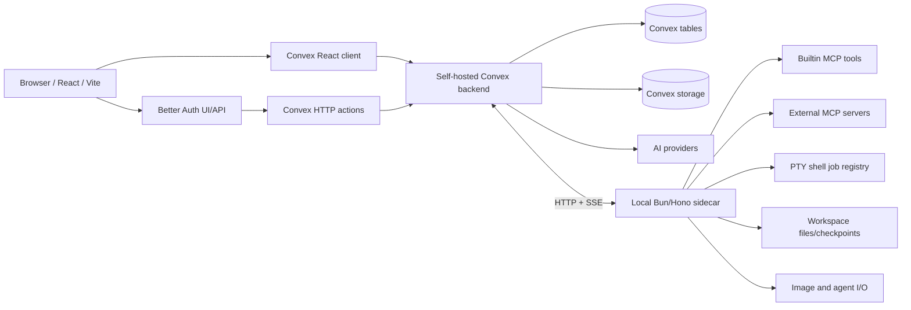

# Project Analysis

Updated after inspecting the current codebase through commit `709b4cd`
(committed 2026-07-09) plus the uncommitted `messageContents` restructure in
the working tree, with source inspection on 2026-07-10.

This document describes the project as it exists now. Operational follow-up
items belong in `PROJECT_STATUS.md`.

## Executive Summary

`chat` is a self-hosted AI workspace for agentic coding workflows, creative
writing, and collaborative chat sessions. It is a Bun workspace with four main
packages:

- `packages/client`: React 19 and Vite frontend
- `packages/convex`: Convex backend, data model, actions, and business logic
- `packages/core`: shared runtime-neutral types and helpers
- `packages/sidecar`: local Bun/Hono service for MCP, workspace, shell jobs,
  and image/agent I/O

The application is organized around sessions. A session can contain humans,
linked agents, messages, files, workspace bindings, tool approvals, request
logs, a session mode (normal or plan), a plan document, and a durable stream
for the currently running agent turn. Users create agents with model settings,
prompts, tools, appearance, and context behavior. The first created user
becomes an admin; admin users can bind local workspaces and use local file or
command tools.

The current runtime loop is:

1. A user signs in through Better Auth and Convex.
2. The user creates, joins, or opens a session.
3. The session may have a bound workspace, a mode, and one active linked agent.
4. The user submits text, attachments, commands, or `@path` file mentions.
5. Convex stores the user/system/assistant turn as a `messages` doc plus a
   version-1 content row in the `messageContents` side table.
6. If an agent should respond, Convex reserves a durable `streams` row; the
   processing message doc and its active content segment are created on claim
   (deferred, debounced through `fireAt`).
7. A Convex Node action builds prompts, history, provider options, tools, file
   context, and workspace instructions.
8. AI SDK provider output patches the active content segment in realtime; when
   a segment passes the split byte cap it is sealed and a new segment row is
   appended to the same turn.
9. Tool calls may run through builtin web tools, plan tools, external MCP
   tools, or local workspace/shell tools.
10. The stream completes, provider-retries, pauses for tool approval, stops,
    fails, is resumed later, or regenerates an existing agent turn as a new
    selected version.
11. The React client observes Convex updates, maintains a byte-bounded
    segment-granular message window, and renders stable virtualized message
    rows.

The major recent architectural changes are:

- **Content side-table restructure**: `messageVersions` was replaced by
  `messageContents`. A `messages` doc is now one logical turn; all content
  lives in side-table rows keyed `(messageId, version, segmentIndex)`.
  Splitting, retrying, and editing collapsed into one uniform model.
- **Message splitting at a byte cap**: long streaming turns no longer bloat a
  single document or fork continuation docs; the active segment is sealed at
  64KB and a new segment row is appended to the same turn.
- **Byte-gated, segment-granular windowing**: the message window is bounded by
  byte budgets as well as row counts, and pages may include partial messages
  at their edges (a segment suffix/prefix of a giant turn).
- **Plan mode**: sessions have a normal/plan mode, a `plans` table, dedicated
  `edit_plan` / `enter_plan_mode` / `exit_plan_mode` tools, a plan block UI,
  and approval-gated non-read-only shell commands while planning.
- **SSE shell jobs**: terminal polling was replaced by server-sent events
  between Convex and the sidecar; the bash subsystem was refactored into a
  `shell` job registry (tools: `shell`, `shell_output`, `kill_shell`).
- **AI SDK v7 migration** and provider option updates.
- **Math rendering**: LaTeX support in markdown and the Tiptap editor with a
  shared KaTeX cache and a per-agent-overridable `mathMode`
  (off/single/double).
- **Overridable settings**: a shared `overridableFields` validator lets agents
  override user-level settings (scroll mode, custom CSS, theme, math mode,
  chat width, compaction/impersonation/plan prompts) with explicit `unset`
  semantics.
- **Message actions rework**: the footer actions bar was replaced by a
  row-aware context menu with per-part edit/delete and range deletion
  ("delete from here" across messages and parts).
- **Tool error propagation**: tool failures throw a typed `ToolError` that
  becomes an `output-error` part, replacing string-matching heuristics; file
  edit/write tool calls get schema repair and clearer errors.
- **Typing indicators**, slow mode, stream debounce, non-heuristic auto
  titles with first-message fallback, and grow-only message row heights to
  stabilize the virtualizer.

## Runtime Topology



Default local ports:

- `4173`: production preview frontend
- `5173`: Vite dev frontend
- `3210`: self-hosted Convex backend
- `3211`: Convex HTTP actions and auth site
- `3212`: sidecar and builtin MCP server
- `6791`: optional local Convex dashboard in dev mode

`./start.sh` and `./dev.sh` delegate to `bun scripts/runner.ts`. The runner
loads `.env.local` if present, prepares local generated state under `.data`,
starts the sidecar, starts the self-hosted Convex backend, configures Convex
environment variables, deploys or starts Convex functions, and starts either
Vite dev or Vite preview. The sidecar binds to `127.0.0.1`.

`convex.json` remains at the repository root and points Convex at
`packages/convex/src`, allowing the backend source to live inside the
workspace while Convex still finds its root configuration.

## Technology Stack

The project is TypeScript-first and Bun-first:

- Bun for package management, scripts, tests, sidecar execution, and workspace
  orchestration
- React 19, Vite, Wouter, and Tailwind CSS v4 for the frontend
- Base UI for headless UI primitives where needed
- Convex for realtime queries/mutations/actions, storage, search indexes,
  crons, auth integration, and the self-hosted backend runtime
- Better Auth through `@convex-dev/better-auth`
- AI SDK v7 for model streaming, UI message streams, tools, reasoning, usage,
  warnings, and model-message conversion
- Provider integrations for Anthropic, DeepSeek, Mistral, OpenAI, OpenRouter,
  Ollama, and custom OpenAI-compatible endpoints
- Hono for the local sidecar HTTP API (with SSE streaming for shell jobs)
- MCP SDK for builtin sidecar tools and external MCP client connections
- Tiptap, React Markdown, Shiki, KaTeX, Comlink workers, `virtua`
  (window-scroll virtualizer), xterm, and `node-pty` for editing, rendering,
  highlighting, math, virtualization, and terminal output
- `@convex-dev/migrations` for throwaway local data migrations

## Source Layout

Important areas:

- `packages/client/src/App.tsx`: top-level app routing and auth/profile gates
- `packages/client/src/providers`: Convex/Better Auth and font providers
- `packages/client/src/components/chat`: chat shell, sessions, sidebars,
  composer, messages, plan block, history search, workspace controls,
  shortcuts, prompts, agent settings, and user settings
- `packages/client/src/components/ui`: shared UI primitives plus reusable
  code-editing, completion, Shiki code-block, inset drawer, and control
  components used across settings and chat surfaces
- `packages/client/src/hooks/chat`: Convex-backed chat hooks for sessions,
  messages, message windows, search, streams, sends, settings, tools,
  workspaces, sharing, compacting, and editing
- `packages/client/src/lib/chat`: pure client chat helpers, message/stream
  stores, command registry, message transforms, rows, window math, prompts,
  file mentions, session store, and tool output helpers
- `packages/client/src/lib/code-block-editing.ts`,
  `packages/client/src/lib/dynamic-block.ts`, and related editor helpers:
  shared Tiptap extensions for code indentation, pair handling, dynamic prompt
  blocks, math decorations, selection clearing, and Markdown serialization
- `packages/convex/src`: Convex schema, public functions, internal functions,
  validators, auth wrappers, crons, actions, and model logic
- `packages/convex/src/model`: backend business logic split by domain
  (including `messageContents.ts` and `plans.ts`)
- `packages/convex/src/actions`: Node actions for streams, sessions,
  workspace I/O, terminals, messages, MCP discovery, and import/export
- `packages/core/src`: shared types, tool descriptions, file mention parsing,
  prompt interpreter, byte-budget constants, and helpers
- `packages/sidecar/src`: local HTTP server (`main.ts`), builtin MCP tools and
  external MCP bridge (`mcp/`), PTY shell job registry and SSE routes
  (`shell/`), and image/agent I/O (`io/`)
- `tests`: Bun tests split into `ai`, `auth`, `chat`, `client`, `core`,
  `markdown`, `mcp`, and `server` suites

## Data Model

The Convex schema is compact but central to the architecture:

- `users`: Better Auth subject plus application role
- `settings`: user-owned profile, model providers, web search instances, MCP
  servers, prompts, fonts, theme, recent selections, behavior settings, and
  the overridable presentation fields
- `agents`: user-owned agents with prompts, model id, reasoning effort,
  inference parameters, enabled tools, context settings, sharing behavior,
  and their own copy of the overridable fields (agent overrides user)
- `sessions`: canonical conversation state, owner, title, active agent, mode
  (normal/plan), environment, settings, metadata, workspace binding, tool
  approvals, and latest activity previews
- `userSessions`: per-user session membership/list rows for owners and shared
  members; also denormalizes title and activity for listing and search, plus
  the user's last send time for slow mode
- `sessionShares`: hashed invite tokens with revocation
- `sessionAgents`: links agents into sessions
- `messages`: one row per logical turn — sender identity, role, status,
  sender snapshot, context eligibility, `selectedVersion`, `versionCount`,
  and denormalized whole-turn metadata for the selected version. **No content
  lives here.**
- `messageContents`: the content side table. One row per
  `(messageId, version, segmentIndex)` holding UI-message `parts`,
  a per-segment metadata slice, per-segment `searchText`, denormalized
  `sessionId` for the search filter, and `senderSnapshot` on segment 0 only.
  Versions are 1-based; segment indexes are 0-based and may have gaps after
  part deletion (rows are deleted when emptied, never renumbered). Indexed by
  `by_messageId_version_segment`; full-text `search_contents` over
  `searchText` filtered by `sessionId`.
- `streams`: durable in-flight agent turns with lease, operation
  (invoke/compact/impersonate/retry), mode, blocking flag, retry state,
  debounce `fireAt`, follow-up suppression, optional instructions, context
  boundary, `processingMessageId`, and `processingContentId` (the active
  segment row)
- `plans`: per-session plan document with draft/approved status, a dirty flag
  for manual user edits, and an update timestamp
- `typing`: expiring per-user typing indicator rows
- `attachments`: user-uploaded or AI-generated files in Convex storage
- `avatars`: full and thumbnail avatar storage ids
- `editorScripts`: user-defined text-editing scripts with icon, pinning, and
  explicit owner ordering
- `offloadedOutputs`: storage tracking rows for large tool outputs

Search indexes exist for message content segments and per-user session titles.
Important query indexes support session membership, active streams, message
windows, content-segment lookup, sender filtering, stream leases, attachments,
avatars, and agent links.

## Auth and Roles

Authentication uses Better Auth backed by Convex. The backend wraps public
queries and mutations with `authQuery` and `authMutation` in
`packages/convex/src/functions.ts`.

On mutation, the wrapper creates the application `users` row if it does not
exist yet. The first user becomes `admin`; later users become regular `user`
accounts. Admin checks are used for local workspace operations, workspace tool
access, and tool approvals.

The session access model is separate from global roles:

- Global roles decide whether a user can perform privileged local operations.
- `userSessions` decides whether a user can see or participate in a session.
- Only session owners can mutate owner-controlled session settings such as
  title, active agent, workspace binding, sharing, disabling, and removal.

## Sessions and Collaboration

Sessions are owned by one user but can be shared with other authenticated
users. Sharing creates a revocable random token whose SHA-256 hash is stored
in `sessionShares`. Redeeming a valid token inserts a `userSessions` row with
role `member`.

Session listing queries `userSessions` rather than `sessions` so the sidebar
contains both owned and shared sessions. Session rows include participants
from both `userSessions` and `sessionAgents`, giving the UI enough data to
render humans and linked agents without querying each row separately.

Each session can have:

- one active agent
- multiple linked agents
- one optional workspace binding
- a mode: `normal` or `plan` (an `ask` mode is planned); the mode can be
  toggled even in an empty chat
- per-session tool approval state
- mutable environment variables used by prompt interpolation
- per-session settings and metadata for usage totals, model display data, and
  request/response logs
- expiring typing indicator rows so participants see who is writing
- optional slow-mode pacing based on each member's last send time

Disabling a session stops active streams and prevents new message sends or
agent invocations while preserving the data.

## Agents and Settings

Agents are user-owned entities with their own behavior and presentation:

- prompt items and prompt ordering
- optional use of global and library prompts
- selected model id and reasoning effort
- temperature, top-p, frequency/presence penalties, repeat penalty, context
  window, output token cap, and context trimming
- enabled tool names
- display name, avatar, and sharing/masking rules for other participants

Presentation and prompt-frame settings that exist at both the user and agent
level go through a single shared `overridableFields` validator: scroll mode,
custom CSS, theme snapshot, math mode, chat width, and
compaction/impersonation/plan prompt sets. The effective value is
agent-overrides-user (not a table merge), and agents can explicitly clear an
override through an `unset` list.

User settings additionally hold display name, avatar, fonts and layout sizing,
global/library prompts, model provider configs, web search instances, external
MCP servers, theme mode, and recent model/agent/reasoning/workspace
selections. User-owned editor scripts live in the separate `editorScripts`
table.

The frontend uses React Hook Form schemas in user and agent settings
components, then persists normalized settings through Convex mutations.

## Client Architecture

The top-level client path is:

```text
main.tsx
  -> ConvexClientProvider
    -> App
      -> LightboxProvider / Toaster
        -> AuthGate
          -> ProfileGate
            -> FontProvider
              -> Router / catch-all route
                -> ChatApp
                  -> AvatarUrlProvider / AttachmentUrlProvider
                    -> Chat
```

`Chat` is a small shell component. It reads stable shell state, wraps the
screen in `ChatSearchProvider`, renders the left/right sidebars, and chooses
between `EmptyChat` and `ChatSession`.

`ChatSession` installs a fresh `ChatMessagesProvider` and `StreamStoreProvider`
per active session. `ChatSessionContent` wires data and commands:

- send message
- stop stream
- edit message or an individual message part
- delete message/part ranges ("delete from here")
- retry an agent turn as a new version
- select older/newer turn versions
- compact
- resume latest agent message
- impersonate
- add assistant/system messages
- toggle plan mode and manage the session plan
- invoke active agent manually
- open shortcuts dialog
- load workspace file index for `@path` mentions

`ChatSessionView` owns the active screen composition: the window-virtualized
`MessageList`, message highlight provider, history search dialog, plan block,
prompt strip, sticky bottom behavior, dock visibility, composer, editor
toolbar, docked terminal widget, scroll-to-bottom pin button, stream
warnings/errors, tool approval picker, and keyboard inset handling.

The sidebars are split into reusable `Sidebar` primitives: the left sidebar
holds new/join session, the session list, agent management, and user settings;
the right sidebar holds the active session panel, participant/agent controls,
search affordance, and a compact agent strip. Sidebar pinned/collapsed state
is stored locally through `packages/client/src/lib/ui-settings.ts`.

Message actions live in a row-aware context menu rather than a per-message
footer bar: right-clicking a rendered part group offers part-level edit and
delete plus range deletion, with menu state carrying `{segmentIndex,
partIndex}` addresses.

## Message Loading and Rendering

Messages are loaded through `useMessageWindow`, a bounded reactive window with
three modes:

- `live`: pinned to the newest messages
- `older`: shifted toward older history
- `newer`: shifted toward newer history, including search targets

The window is gated by **both row counts and byte budgets** (constants in
`packages/core/src/const.ts`): pages up to 128KB / 40 rows, a total window up
to 512KB / 160 rows. It exposes controls for loading older, loading newer,
returning to latest, and anchoring a window around a selected message — and
anchors can carry a `segmentIndex`, because the window is
**segment-granular**: a page may include only a slice of a huge turn's
segments at its edge.

Convex backs this with `messagesWindow`, which pages over
`messages.by_sessionId` and joins each turn with its selected-version segment
rows from `messageContents` outward from the anchor under the byte budget
(`joinSegmentsWithinBudget`). The join may stop mid-message, keeping the
anchor-side segment slice and setting per-message `hasOlderSegments` /
`hasNewerSegments`. The wire shape carries `segments[]` with per-segment
sizes; the client concatenates parts in `convertDoc`. Client-side window math
(`lib/chat/window-math.ts`) does the same segment-flattened byte walks when
trimming, so a boundary message can be reduced to a segment suffix.

When consecutive live windows overlap, `message-merge` retains older display
rows from the previous client store while accepting the new bounded Convex
result, and additionally unions boundary-message segment lists grow-only so
sealed segments stay visible as they slide out of the live query. On a version
mismatch (a retry happened), the incoming generation wins wholesale. The live
window itself is append-only — the head is never trimmed while pinned.

Message search uses Convex full-text search over
`messageContents.search_contents` (per-segment `searchText`, filtered by the
denormalized `sessionId`), post-filtered to each message's selected version.
Results carry the hit's `segmentIndex`, so selecting a result anchors the
window on the exact segment even inside a turn too large to load whole.

The client converts selected-version parts into AI SDK UI-message shapes and
syncs them into `createMessageStore`. The store stabilizes message objects,
metadata maps, row arrays, window metadata, and window controls; consumers
subscribe through `useSyncExternalStore` selectors so streaming patches do not
rerender unrelated rows.

Rows are derived in `packages/client/src/lib/chat/rows.ts`:

- `header` rows for sender/system metadata and leading reasoning
- `group` rows for renderable grouped message parts, built **per segment**
  with keys `g:${id}:s${segmentIndex}:${groupKey}` — intra-segment part
  indexing keeps keys stable when older segments are prepended during
  scroll-back
- `footer` rows for pending, error, duration, version switching, and
  end-of-message controls

The list itself renders through virtua's window-scroll `WindowVirtualizer`.
Message rows clamp to grow-only heights (only an explicit collapsible collapse
shrinks a row) so streaming and prepends do not cause viewport jumps. Nothing
nests a second virtualizer or `content-visibility` inside the list.

Rendering is split across message components for text, files, file links,
reasoning, summary, tools, terminal output, web fetch output, file changes,
plan blocks, and large-output loading. Consecutive `read_file` and `shell`
tool parts are grouped into compact blocks, and file mutation parts render
sidecar-provided or approval-preview unified diffs. Markdown supports LaTeX
math — inline and standalone `$$…$$` display blocks — rendered through a
shared KaTeX cache, with the editor decoration and the remark plugin kept in
lockstep and the whole feature gated by the overridable `mathMode` setting.

## Message Versioning, Splitting, and Retry

A `messages` doc is a stable conversation position for one logical turn; all
mutable content lives in `messageContents` rows keyed
`(messageId, version, segmentIndex)`. Three previously distinct mechanisms are
now the same primitive:

- **New message**: insert the doc plus a `(version 1, segment 0)` content row.
- **Splitting**: while streaming, when the active segment's serialized parts
  pass `MESSAGE_SPLIT_BUDGET_BYTES` (64KB), the segment is sealed (final
  parts, search text, metadata slice) and an empty
  `(same version, segmentIndex + 1)` row is appended; the stream's
  `processingContentId` moves to it. No new doc, no context-boundary change —
  compaction streams never split.
- **Retry**: append a `(versionCount + 1, segment 0)` row, select it, and
  stream into it. Because versions are turn-level, retrying a turn that had
  split into many segments works uniformly; the old generation's rows remain
  intact under the old version number and the footer version switcher flips
  between whole generations.
- **Editing**: editing a whole message collapses the selected version back to
  a single segment-0 row; editing one part writes only its segment row. Part
  addresses everywhere are `{segmentIndex, partIndex}` within the selected
  version.
- **Deletion**: `deleteMessageParts` takes explicit addresses plus an optional
  `from` address that the server expands across later segments (so "delete
  from here" works even when newer segments are not loaded client-side).
  Segment rows are deleted when emptied — leaving index gaps, never
  renumbering — and the whole doc is deleted when no selected-version row has
  parts, in which case the client evicts it from the store.

The doc mirrors selected-version state through denormalized fields:
`contextEligible`, `senderSnapshot`, and `metadata`, where doc metadata is a
whole-turn accumulation over segments (`mergeSegmentMetadata`: summed
durations, unioned tool errors/warnings, last usage/error) and each segment
row keeps its own slice. Switching versions recomputes them. Version switching
is disabled while the session has an active stream.

Deleting a message deletes all content rows across versions and releases
offloaded tool-output blobs not referenced elsewhere. Post-generation message
evaluation is segment-scoped: it reads and rewrites exactly one
`(version, segmentIndex)` row.

## Composer and Commands

`ChatComposer` owns local editor state, staged files, command mode, send
behavior, silent sends, the active-agent picker slot, quick settings slot
(which the toolbar collapses into on mobile), and workspace file mention
picker state. The editor is lazy-loaded Tiptap with Markdown serialization,
Shiki-backed code blocks, math decorations, placeholder refresh logic, and
decorations for workspace mentions.

Commands are registered in `packages/client/src/lib/chat/commands` and
include:

- `/compact`
- `/resume`
- `/impersonate`
- `/assistant`
- `/system`
- `/plan`
- `/shortcuts`

Normal user sends can include typed attachments, pasted files, and `@path`
mentions. Mention parsing is shared through `packages/core`: paths with spaces
use `@"path with spaces"`, escaped `@` signs are ignored, and markdown
rendering wraps detected mentions in a styled node. If the session has a
workspace, the client resolves file mentions once before sending, and the
message stores `file-link` parts with immutable file, directory, or binary
snapshots in addition to the text part. The client strips those snapshots from
normal query results, but provider history can still use them for stable
context.

Workspace file autocomplete is intentionally lazy: the flat file index loads
on first mention use, refreshes when a new mention starts, and is kept from
thrashing with a short rescan cooldown.

When the composer is empty and a session has an active agent, pressing Enter
can continue the latest agent turn. Shift+Enter sends normally, and
Ctrl/Cmd+Enter sends silently. In command mode, plain Enter runs the matched
command and Ctrl/Cmd+Enter runs it silently.

## Editors, Scripts, and Dynamic Blocks

Editing is a shared subsystem rather than a one-off composer feature:

- `CodeBlockShiki`: Shiki-backed code block rendering with line-number
  support, optional gutters, aliases, custom themes, and Markdown rendering
  hooks
- `CodeEdit`: Tiptap keyboard behavior for Tab/Shift-Tab indentation, newline
  indentation rules, bracket/quote pairing, pair deletion, line insertion, and
  line-number-aware backspace handling
- `CodeEditor`: a standalone one-block code editor used for JavaScript scripts
  and CSS settings fields
- `useCodeCompletion`: caret-anchored completions with Fuse matching,
  snippets, keyboard navigation, and delayed display while typing
- `DynamicBlock`: a Tiptap extension that parses dollar-prefixed fenced prompt
  blocks as executable dynamic code blocks

Editor scripts are user-owned text transforms stored in `editorScripts`. A
script receives `text`, `paragraph`, `message`, and the Tiptap `editor`; it
can return a string to replace the selection or call helpers such as
`replaceParagraph`, `replaceMessage`, `replaceToEnd`, and matching delete
helpers. Scripts can be pinned to the bubble toolbar, reordered in the script
manager, and edited in a JavaScript `CodeEditor` with completions for helper
names and variables.

Prompt content editing uses `PromptContentEditor`, a Tiptap Markdown editor
with normal Markdown blocks plus dynamic <code>$```...```</code> blocks.
Dynamic blocks get session-environment completions for `user`, `owner`,
`agent`/`assistant` aliases, `tools`, `isAdmin`, participant counts, `$get`,
and `$set`. A prompt evaluation preview is available outside sessions.

## Backend Entry Points and Model Layer

Convex public modules such as `chat.ts`, `sessions.ts`, `agents.ts`,
`settings.ts`, `editorScripts.ts`, `attachments.ts`, `tools.ts`, and
`users.ts` are intentionally thin. Most business logic lives in
`packages/convex/src/model`.

Key backend domains:

- `model/chat`: message sends, command-like mutations, stream reservation,
  queries/windowing, search, approvals, controls, starters, identities,
  retry/version selection, and segment-scoped evaluation
- `model/session`: session creation/listing/update/removal, memberships,
  sharing, workspace metadata, title generation, archive import/export,
  session agents, and request logs
- `model/stream`: lifecycle (claim/patch/continue/complete/fail/stop),
  reads/history, retries, transformers, usage accounting, generated files,
  and tool-output offloading
- `model/messageContents`: turn/content-row insertion, segment append and
  sealing, version add/select, segment-scoped patching, finalization, metadata
  accumulation, cleanup, and selected-version joins (`withParts`)
- `model/plans`: plan document lifecycle for plan mode
- `model/provider`: model listing, provider credential lookup, provider
  construction, reasoning options, penalties, and custom endpoints
- `model/prompt`: prompt merging, dynamic markers, interpreter markers,
  compaction/impersonation/plan prompts, and message-history placement
- `model/tool`: shell execution adapters, tool-call repair, and model-output
  normalization
- `model/attachments`, `model/avatars`, `model/settings`, `model/users`,
  `model/editorScripts`, `model/typing`, and `model/sidecar`: supporting
  domains

`migrations.ts` holds a bare `@convex-dev/migrations` runner; migrations are
defined ad hoc for local restructures and deleted after running.

## Message Send Flow

`sendMessage` performs the main user-message mutation:

1. Require session membership and an enabled session.
2. Allow only non-blocking active streams; enforce slow mode when configured.
3. Validate staged attachments.
4. Insert starter prompts if needed.
5. Match pre-resolved workspace file snapshots to parsed `@path` mentions.
6. Build message parts from attachments, file links, and text.
7. Resolve sender identity and sender snapshot.
8. Insert a completed `messages` doc plus its `(v1, seg0)` content row with
   per-segment `searchText`.
9. Attach staged uploads to the message.
10. Schedule message interpolation if text contains dynamic markers.
11. Sync latest activity onto `sessions` and all `userSessions` rows.
12. Reserve an agent stream if the send is not silent and an active agent is
    available; the stream's actual processing message is created lazily on
    claim, and rapid consecutive sends are debounced through the stream's
    `fireAt`.
13. Schedule title generation when no stream is expected. Titles are generated
    non-heuristically and always fall back to a truncation of the first
    message.

Manual agent invocation, compaction, impersonation, resume, and retry all
reserve streams through the same durable stream machinery with different
operations.

## Stream Lifecycle

Agent turns are represented by `streams` rows, a processing `messages` doc,
and the active `messageContents` segment row (`processingContentId`). This
makes in-flight work visible to the client and recoverable enough for
stopping, provider retries, approval, turn-version retries, and stale-lease
pruning.

The stream action flow is:

1. `_claim` marks the stream as `streaming`, refreshes the lease, computes or
   preserves the context boundary, and may recreate the processing message so
   ordering stays correct. A turn is only "fresh" (boundary recomputable) when
   its active row is an empty segment 0 — a post-split empty segment never
   moves the boundary.
2. `prepare` loads stream context, builds an operation plan, evaluates prompts
   through the sidecar interpreter, resolves provider credentials/options, and
   builds enabled tools.
3. `consumeProviderStep` calls AI SDK `streamText`, reads the UI-message
   stream, patches the active segment row at a throttled interval, tracks
   timings and warnings, and offloads large payloads.
4. Between steps, `_continue` handles rollover: if a newer user message
   arrived, the current turn is finalized and processing rolls over to a new
   message; if the active segment passed the split cap, it is sealed and a new
   segment is appended (same doc, same boundary, doc stays `processing`).
5. The stream either completes, continues for another tool step, pauses for
   approval, schedules a provider-rate-limit retry, or fails with sanitized
   metadata — writing error/usage metadata to both the segment row and the
   doc's accumulated metadata.

Important stream behavior:

- `PATCH_INTERVAL_MS` throttles segment patches; splitting caps each patched
  document at ~64KB so realtime writes stay small.
- Provider tool stepping is bounded by `MAX_STEPS`.
- Leases expire and are pruned if a stream is abandoned; approval waits use a
  longer lease.
- Stopped streams finalize the turn, preserve retry errors, kill foreground
  shell jobs, and remove the stream row.
- Completed invoke streams update activity, schedule title generation, and may
  reserve a follow-up turn if a user message arrived during the previous agent
  response (suppressible via `suppressFollowUp`).
- Completed retry streams update activity and title only when the retried
  turn is still the newest session message.
- Resuming an agent message reuses the previous agent sender and processing
  message; retrying appends and selects a new version on the same turn and
  suppresses automatic follow-ups.
- Provider history includes the in-progress processing turn for `invoke` and
  `retry` streams when it has any content across its segments (`withParts`
  concatenates them), preserving approved tool calls across retry/continue
  steps and across segment boundaries.

## Plan Mode

Sessions can enter plan mode, which frames the agent as a planner:

- The session `mode` flips to `plan` (toggleable from the UI even in an empty
  chat, or via the `/plan` command, or by the agent through
  `enter_plan_mode`).
- The `plans` table holds one plan per session with `draft`/`approved` status
  and a `dirty` flag marking manual user edits.
- Plan tools: `edit_plan` mutates the plan document (returning a slim
  confirmation, not the full plan), `exit_plan_mode` presents the plan for
  approval and fails fast when no plan exists, and repeated
  `enter_plan_mode` calls are no-ops.
- While in plan mode, non-read-only `shell` commands always require explicit
  approval, and plan prompts (user-level, agent-overridable) frame the
  conversation.
- The client renders the plan as a dedicated plan block that scrolls into
  view on update.

## Prompt and History Construction

Prompt construction is operation-specific:

- `invoke`: normal agent prompts plus global/library prompts (plus plan
  prompts in plan mode)
- `compact`: compaction prompts frame the history and produce a summary
  message
- `impersonate`: impersonation prompts frame the history and produce a
  user-role message from the active user identity

Prompt items are evaluated through the sidecar interpreter so prompts can read
and mutate the session environment. If evaluation dirties the environment,
Convex patches the session environment after the provider step.

The interpreter supports inline `{{ expression }}` segments and executable
`$```...``` code blocks while leaving normal fenced code and inline backticks
alone. Dynamic code receives a fixed bindings map from
`packages/core/src/interpreter/env.ts`: user/owner/agent aliases, participant
counts, available tool names, admin status, and `$get`/`$set` helpers backed
by the session environment store. Empty dynamic blocks trim one following
newline so prompts do not accumulate blank spacer lines.

Provider history is built from eligible done messages up to the stream context
boundary, joined through each turn's selected-version segments in order. For
`invoke` and `retry`, the processing turn is also included when it already has
parts so a multi-step stream can continue from its own tool calls. Before
conversion to model messages:

- file attachments are loaded from Convex storage as data URLs
- offloaded tool outputs are loaded back from storage
- snapshotted file-link parts are converted into file/directory/binary context
- sender names may be prefixed according to agent sharing settings
- other agents may be masked as user messages according to agent settings
- incomplete or orphaned tool calls/results are sanitized
- prompt messages are inserted around history markers
- optional context trimming applies when the agent has a context window

Workspace `AGENTS.md` instructions are read through the sidecar when an admin
invoker and workspace are present, then injected as file-block context.

## Tools

Tool selection is centralized in `packages/convex/src/model/tools.ts`.

Builtin user-visible tools:

- `web_fetch`
- `web_search`
- `read_file`
- `write_file`
- `edit_file`
- `shell`

Internal companion tools:

- `shell_output` and `kill_shell` (included automatically with `shell`)
- `check_paths` on the sidecar
- plan tools (`edit_plan`, `enter_plan_mode`, `exit_plan_mode`) exposed by
  mode

Tool availability depends on user role, session workspace state, session mode,
configured web search instances, configured MCP servers, and the agent's
selected tool names. Workspace tools require an admin invoker and a bound
workspace.

Workspace tool outputs are structured JSON through the builtin MCP bridge:
`read_file` returns path, content, total line count, 1-indexed offset, and
truncation status; `write_file` and `edit_file` return checkpoint ids plus
capped unified diffs; `shell` returns model-friendly text while retaining
terminal tails for the UI.

Tool failures are typed: adapters throw `ToolError`, which becomes an
`output-error` part on the message — there is no string-matching failure
heuristic. Malformed file edit/write calls go through schema repair
(`model/tool/repair.ts`): plain-string `edit_file` content is redirected to
`write_file`, and errors are made descriptive instead of crashing the step.
Failure durations and tool errors are accumulated into turn metadata.

Tool approval is enforced in Convex:

- `write_file` and `edit_file` require approval unless auto-approved.
- `shell` requires approval unless the command and referenced paths are
  allowed. Safe-listed programs with mutating arguments (`find -delete`,
  `sed -i`, sed exec/write scripts) are argument-gated back to approval.
- Nothing hard-fails: `.git` access (detected by path checks and
  command-reference checks, with match/exclusion flag arguments like
  `-not -path` globs exempt) and non-read-only commands in plan mode always
  surface an approval dialog instead. Sub-agent sessions auto-deny those
  requests.
- The sidecar reports paths that are git-ignored or outside the workspace so
  Convex can require approval for risky commands.
- File mutation approval requests ask the sidecar for a simulated
  `/workspace/preview-diff` result, then attach the diff to the tool part so
  the UI shows the exact proposed change before approval.
- Approvals are gated to admin users; scroll-follow resumes automatically
  after an approval.

Tool descriptions and edit-field descriptions are shared from
`packages/core/src/types/tool-descriptions.ts`; workspace tool input fields
are shared from `packages/core/src/types/workspace-tools.ts`. This avoids
drift between the model-facing tool definitions and the sidecar MCP server.

## Builtin Web Tools

`web_fetch` and `web_search` are model tools implemented as sidecar MCP tools.

`web_fetch` accepts a URL and optional length limit, uses the builtin
fetch/readability pipeline, returns clean markdown plus title/source metadata,
rejects empty readable-content extraction, and truncates long markdown to a
configured maximum.

`web_search` currently supports SearXNG instances; accepts category, language,
time range, safe search, page, and max-result options; tries configured
instances in order under a total time budget; and returns the first successful
result set or a combined failure message.

User settings store web search instances. The AI tool is only exposed when at
least one valid instance is configured.

## External MCP Tools

Users can configure external MCP servers in settings. Each server stores a
label, URL, transport (SSE, WebSocket, or Streamable HTTP), optional bearer
API key, enabled flag, and discovered tool metadata.

The client settings screen can discover tools by calling
`api.actions.mcp.discoverMcpTools`, which asks the sidecar to connect to the
external MCP server and list its tools. Input schemas are serialized as
strings because JSON Schema commonly contains `$`-prefixed keys that Convex
validators reject as object field names.

At stream time, enabled external tools are wrapped as AI SDK tools. Tool names
are prefixed with a slug of the server label through `mcpToolName`, which
reduces collisions with builtin tools or other servers. If a collision still
exists, builtin or earlier tools win.

External calls flow:

```text
AI SDK tool call
  -> Convex tool wrapper
    -> sidecar /mcp-ext/call
      -> MCP client transport
        -> external MCP server
```

Only text content is returned to the model. MCP error results are converted
into tool failures.

## Workspace and Sidecar

The sidecar owns local machine interactions that Convex cannot or should not
do directly:

- builtin MCP server at `/mcp`
- external MCP discovery/calls at `/mcp-ext/list` and `/mcp-ext/call`
- PTY shell job routes under `/shell` (SSE streaming plus control endpoints)
- prompt and message interpolation routes under `/eval/*`
- agent import/export image routes under `/io/agent/*`
- image thumbnail/PNG processing under `/io/image/*`
- workspace bind, clear, list, read, file-link resolution, diff preview,
  instructions, and checkpoint restore routes under `/workspace/*`

Workspace bindings are persisted by the sidecar and referenced from Convex
sessions as `{ workspaceId, label }`. Convex actions authorize the user and
session, then call the sidecar with the session id and workspace id.

The sidecar workspace layer handles directory picking/listing, file index
generation (preferring `git ls-files` with a glob fallback), file and
directory mention resolution, safe line-windowed file reads, write/edit
operations with no-op rejection, BOM/line-ending preservation, per-file
serialization, checkpointing, capped unified diffs, simulated diffs for
approval previews, path sensitivity checks, workspace instructions discovery,
and checkpoint restoration.

Convex never reads arbitrary local files directly. It calls the sidecar only
after auth and role checks. The sidecar does not hot-reload; changes to it
require a restart.

## Shell Jobs

Shell execution has two consumers over one PTY-backed job registry
(`packages/sidecar/src/shell`):

- the `shell` model tool, which starts sidecar jobs and yields preliminary
  terminal tails plus final model-friendly text
- the terminal UI, which streams job output and manages stdin, resize,
  detach, and kill/list controls

Job output is pushed over **server-sent events** rather than polled; the SSE
connection between Convex and the sidecar is recycled periodically to stay
under Convex's response size limits. The registry is session-scoped: it limits
running jobs per session, keeps a bounded output ring buffer addressed by
absolute offsets, supports stdin/resize/kill/list, foreground-only cleanup,
and optional include-background cleanup.

Foreground commands have a shorter default timeout. Background commands can
run longer and are later queried by `shell_output`; a foreground command can
also be detached into the background after it has started. Finished jobs are
retained briefly and swept, with a short post-exit grace period so final
output is flushed before status changes.

The React UI tails jobs through the SSE feed, caches tails to avoid layout
churn, lets admins kill or detach live jobs from a shell block, and shows a
docked widget listing running session terminals with per-job and stop-all
controls. Transcript rendering groups consecutive shell calls into a single
visual run, hides empty terminal surfaces, and only auto-expands interactive
terminals.

## Attachments, Generated Files, and Large Output

User uploads are stored in Convex storage and represented as `attachments`
rows. Image uploads can have preview storage ids. Before provider calls,
attachments are resolved into data URLs so providers can consume them.

AI-generated file parts are offloaded during streaming: data URLs are parsed,
bytes are stored in Convex storage, an attachment row is created with
`streamId` and `messageId`, and the message part is replaced with an
`attachment:<id>` reference.

Large tool outputs are also offloaded during streaming: over-threshold outputs
are stored as JSON in Convex storage, tracked by an `offloadedOutputs` row,
and the message part keeps a compact preview plus `outputRef`.

When building provider history, offloaded outputs are loaded back from
storage. When streams complete, fail, stop, retry, or are removed, cleanup
checks all content rows of the affected turn — across versions and segments —
so blobs referenced by older or unselected versions are preserved while truly
unused blobs are deleted. A cron-level pruning path also handles stale
orphaned output rows.

## Import and Export

Session archives export a version, exported timestamp, session title,
sanitized messages, sender snapshots, and referenced avatars. Attachments are
intentionally converted to text placeholders during session archive
export/import, while avatars can be carried through storage ids.

Agent import/export is split between Convex model logic and sidecar image I/O:
the sidecar handles PNG metadata and image conversion, while Convex validates
and creates agent/avatar/settings data.

## Search

There are two distinct search systems:

- Session-list search over `userSessions.search_title`
- In-session message search over `messageContents.search_contents`

Message search indexes per-segment `searchText` generated from text parts and
bounded tool inputs; reasoning and tool outputs are excluded so search stays
focused on authored content and meaningful commands. Because the index covers
every version's segments, hits are post-filtered to each message's selected
version (with over-fetch when a page starves). Selecting a different version
rewrites the turn's denormalizations.

The history search dialog uses debounced paginated Convex queries. Selecting a
result anchors the bounded message window around the hit's message **and
segment** and highlights it in the virtualized list.

## Local UI State and Presentation

The project distinguishes persistent server settings from local UI
preferences. Server settings include profile, model providers, prompts, MCP
servers, web search instances, fonts, theme, custom CSS, and agent behavior —
with the agent-overridable subset resolved through `overridableFields`. Local
UI settings include sidebar collapsed/pinned state and local display
overrides.

Themes and avatars are snapshotted into message sender snapshots so historical
messages keep their original appearance even if the user or agent changes
later.

The frontend uses workers for Shiki highlighting and theme work, and a shared
KaTeX cache for math, so expensive rendering support does not block chat
interactions. The same Shiki/Tiptap editing primitives serve visible message
code, prompt dynamic blocks, user scripts, and custom CSS settings.

## Testing Shape

Tests are Bun-based and focused around behavior rather than broad snapshots,
organized as `tests/{ai,auth,chat,client,core,markdown,mcp,server}`. Current
coverage includes:

- stream lifecycle: claim freshness, over-cap segment splitting, rollover,
  retry, resume, debounce, and slow mode
- provider history: selected-version joins, multi-segment concatenation, and
  tool pairs across segment boundaries
- segment-granular window math and server-side segment joins
  (`message-window-budget`, `message-window-join`)
- part addressing, range deletion, and segment-scoped message evaluation
- message rows (key stability under segment prepends), retained
  message-merge, and message-store behavior
- tool approval and approval streaming, tool output and generated-attachment
  offloading, tool errors, and tool-call repair
- plan mode tool behavior
- shell job behavior at both the sidecar route and model-adapter level
- prompt merging, prompt preview, and workspace instruction handling
- file mentions, workspace files, agent import/export data, avatar thumbnails
- auth setup and site URL behavior
- sidecar MCP edit, preview diffs, web fetch, and SearXNG search
- markdown list rendering

The suite mirrors the architecture: pure helpers are tested directly, Convex
model behavior is tested through backend-oriented tests, and sidecar behavior
is tested at the MCP/shell boundary.

## Architectural Boundaries

Current boundaries are clear:

- React is the presentation and interaction layer.
- Client hooks translate Convex state into UI stores and commands.
- Convex public functions authorize and delegate.
- Convex model modules contain application behavior.
- Convex actions perform Node-only and provider/sidecar work.
- `packages/core` holds shared contracts and runtime-neutral logic.
- The sidecar owns local filesystem, shell, MCP transport, image, and
  workspace operations.
- AI providers are accessed only from stream actions after model/provider
  settings are resolved.

This separation lets the project support local coding workflows while keeping
the realtime conversation state durable and queryable in Convex.

## Current Direction From Recent Commits

The recent work shows the project moving in these directions:

- **Uniform content storage**: the `messageContents` restructure removed the
  last special cases around long turns — splitting, retrying, and editing are
  all operations on `(version, segment)` rows of one turn doc, and the
  continuation-doc era (adjacency linking, retry guards, orphan cleanup) is
  gone entirely.
- **Byte-bounded everything**: streaming writes, query pages, and the client
  window are all capped by byte budgets, keeping hot-path document sizes and
  realtime payloads small regardless of how large a single turn grows.
- **Scroll stability as a hard requirement**: window-scroll virtualization,
  grow-only row heights, intra-segment row keys, append-only live windows,
  and grow-only retained-segment merges all serve the same goal — no viewport
  jumps during streaming or scroll-back.
- **Agent workflow structure**: plan mode introduces an explicit
  research-then-approve loop with its own tools, prompts, plan document, and
  read-only shell enforcement.
- **Push over poll**: terminal output moved to SSE with connection recycling,
  eliminating polling loops against the sidecar.
- **Typed failure paths**: tool errors, tool-call repair, and per-turn error
  accumulation replaced string heuristics.
- **Layered configuration**: user-level settings with agent-level overrides
  through one shared validator, covering presentation (theme, CSS, math mode,
  chat width) and prompt frames (compaction, impersonation, plan).
- **Finer-grained interaction**: per-part context-menu actions with
  segment-aware addressing, range deletion that works across unloaded
  segments, and search that seeks to an exact segment inside oversized turns.

The codebase is no longer mainly a chat renderer around Convex messages. It is
a multi-service self-hosted AI workspace whose core complexity is coordinating
durable realtime streams, versioned segmented turns, configurable agents,
local tools, shared sessions, and a responsive large-message UI.
