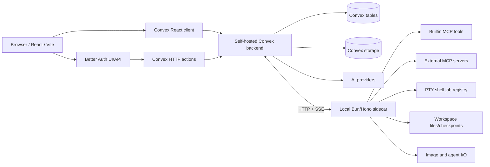

# Project Analysis

Updated after inspecting the current codebase at commit `0d6092b`
(2026-08-05), including the uncommitted working tree. The previous revision of
this document described the tree at `960dd83` (2026-07-29); since then the
backend has been substantially restructured (`bda987e` and its follow-ups), so
the data model, settings, and query sections below are re-derived rather than
patched.

This document describes the project as it exists now. The test suite is green
at this revision (1102 tests across 114 files).

## Executive Summary

Slopbench (temporary name) is a self-hosted AI workspace for agentic coding
workflows, creative writing, and collaborative chat sessions. It is a Bun
workspace with four main packages:

- `packages/client`: React 19 and Vite frontend
- `packages/convex`: Convex backend, data model, actions, and business logic
- `packages/core`: shared runtime-neutral types and helpers
- `packages/sidecar`: local Bun/Hono service for MCP, workspace, shell jobs,
  and image/agent I/O

The application is organized around sessions. A session can contain humans,
linked agents, messages, files, workspace bindings, tool approvals, request
logs, a session mode (normal or plan), a plan document, a todo list, a command
queue, background sub-agent children, and a durable stream for the currently
running agent turn. Users create agents with prompts, tools, and inference
settings, then choose a model independently for each session.
reminders, tools, appearance, and context behavior. The first created user
becomes an admin; admin users can bind local workspaces and use local file or
command tools.

The current runtime loop is:

1. A user signs in through Better Auth and Convex.
2. The user creates, joins, or opens a session.
3. The session may have a bound workspace, a mode, and one active linked agent.
4. The user submits text, attachments, slash commands, `$ <command>` shell
   invocations, or `@path` file mentions.
5. Convex stores the user/system/assistant turn as a `messages` doc plus
   version-1 content rows in the `messageContents` side table (an over-budget
   send fans out across several segment rows on insert).
6. If an agent should respond, Convex reserves a durable `streams` row; the
   processing message doc and its active content segment are created on claim
   (deferred, debounced through `fireAt`).
7. A Convex Node action builds prompts, history, provider options, tools, file
   context, and workspace instructions — reusing the per-(session, agent)
   snapshot in `sessionCache` so the provider request prefix stays
   byte-identical across turns.
8. AI SDK provider output patches the active content segment in realtime; when
   a segment passes the split byte cap it is sealed and a new segment row is
   appended to the same turn.
9. Tool calls may run through builtin web tools, plan tools, todo tools, the
   sub-agent `task` tool, external MCP tools, or local workspace/shell tools.
10. The stream completes, provider-retries, pauses for tool approval, spawns
    background sub-agents, stops, fails, is resumed later, or regenerates an
    existing agent turn as a new selected version.
11. The React client observes Convex updates, maintains a byte-bounded
    segment-granular message window, and renders stable virtualized message
    rows.

Standing architectural themes (established in earlier revisions, still true):

- **Background sub-agents**: an agent can delegate to another owned agent
  through the `task` tool. The engine spawns a hidden child session, settles
  the tool call immediately with an acknowledgment, and delivers the child's
  report to the parent later as its own message part.
- **Request-prefix freezing**: evaluated invoke prompts and the tool wire shape
  are captured once per `(session, agent)` in `sessionCache`, and Anthropic
  cache breakpoints are applied on top, so the prompt cache is not invalidated
  by mid-session state changes.
- **Injected notes and reminders**: mode changes, workspace re-binds, queued
  commands, interval reminders, and todo nudges are persisted as hidden typed
  messages instead of being re-injected per request.
- **Todo tools**: `write_todo` / `edit_todo` back a per-session `todos` row,
  with a turn-counted nudge when work is left unresolved.
- **Command queue**: server-run slash commands invoked during a busy session
  queue on the session and drain when the stream ends, announced by hidden
  command chips.
- **Directive prompt syntax**: the interpreter moved from `$```…``` ` fences to
  fence-free `#eval`/`#end` and `#if`/`#elif`/`#else`/`#endif` directives, plus
  `readFile`/`fileExists`/`getVar`/`setVar` bindings.
- **Literal markdown and HTML**: stored content is verbatim (Tiptap's text
  escaping is patched off), raw HTML stays literal in the editor with a
  decoration preview, and the renderer sanitizes and preserves indentation and
  unknown tags.
- **Draft persistence everywhere**: composer, prompt, reminder, script, plan,
  and settings-form drafts autosave to local storage and are restored behind a
  confirmation dialog, with a page-close guard.
- **Scroll durability**: per-session scroll positions persist across sessions,
  window slides converge back onto the anchor row, version switches hold
  position and cross-fade, and message rows clamp to grow-only heights.
- **Non-heuristic shell interactivity**: the sidecar probes `/proc` for a
  process blocked in `read(2)` on a pty instead of guessing, driving terminal
  auto-expansion.

The themes added by the recent backend rework are:

- **A table per unbounded domain**: prompts, reminders, external MCP servers
  and their discovered tools, model providers, and API keys were lifted out of
  the `settings` and `agents` documents into their own tables (`prompts`,
  `reminders`, `mcpServers`, `mcpTools`, `modelProviders`, `credentials`), each
  ordered by an explicit `order` column. Settings and agent docs are now small
  and stable.
- **Hot state off the session doc**: environment, tool approvals, reminder
  state, the command queue, token usage, and the request log moved to a
  `sessionState` side table, so a session subscription no longer churns on
  every stream write. The provider request/response log is a storage blob, not
  an inline field.
- **Credentials never leave the server**: API keys live in a `credentials`
  table keyed by `(ownerId, scope, ref)`. No public query returns one; the
  settings UI writes keys and reads only presence.
- **Projected queries**: `sessions.list`, `userSessions.list`, and
  `agents.list` return purpose-built rows instead of whole documents, so the
  sidebar never ships another member's settings or a session's workspace path,
  mode, and model to every participant.
- **Interned appearances**: a message's look (custom CSS + theme snapshot) is
  hashed and stored once in an `appearances` table. `senderSnapshot` became
  three denormalized fields — `senderName`, `senderAvatarId`, `appearanceId`.
- **Caps on everything writable**: `packages/core/src/limits.ts` defines a cap
  for every field a user, model, or third-party service can grow, and
  `limitError()` renders every violation the same way. Oversized sends are
  split across segment rows; oversized single parts are rejected.
- **Typed to the edges**: the remaining `v.any()` fields (message `extra`,
  agent tools, token usage, the settings patch) now have real validators.
- **User shell commands**: a message beginning with `$ ` runs in the bound
  workspace as a shell tool call on the _user's own_ message, streamed by a
  self-rescheduling runner action, with the agent turn reserved only once the
  command settles.
- **Origin-aware auth and CORS**: a shared `origins.ts` decides trusted origins
  for both Better Auth and the HTTP-action CORS layer, and the runner passes
  public origins to the backend, which makes an HTTPS reverse proxy a supported
  deployment (`docs/https.md`).
- **MCP transport negotiation**: external MCP servers default to `auto`; the
  sidecar dials Streamable HTTP then SSE and caches the winner per URL.

## Runtime Topology


```mermaid
flowchart LR
  Browser[Browser / React / Vite] --> ConvexClient[Convex React client]
  Browser --> Auth[Better Auth UI/API]
  Auth --> ConvexHTTP[Convex HTTP actions]
  ConvexClient --> Convex[Self-hosted Convex backend]
  ConvexHTTP --> Convex
  Convex --> DB[(Convex tables)]
  Convex --> Storage[(Convex storage)]
  Convex --> Providers[AI providers]
  Convex <-->|HTTP + SSE| Sidecar[Local Bun/Hono sidecar]
  Sidecar --> BuiltinMCP[Builtin MCP tools]
  Sidecar --> ExternalMCP[External MCP servers]
  Sidecar --> Shell[PTY shell job registry]
  Sidecar --> Workspace[Workspace files/checkpoints]
  Sidecar --> IO[Image and agent I/O]
```

Default local ports (all now configurable):

- `4173`: production preview frontend (`FRONTEND_PORT`)
- `5173`: Vite dev frontend
- `3210`: self-hosted Convex backend (`CONVEX_PORT`)
- `3211`: Convex HTTP actions and auth site (`CONVEX_SITE_PORT`)
- `3212`: sidecar and builtin MCP server (`SIDECAR_PORT`)
- `6791`: optional local Convex dashboard in dev mode

`./start.sh` and `./dev.sh` delegate to `bun scripts/runner.ts`, whose
implementation is split across `scripts/runner/` (config, ports, binaries,
processes, Convex orchestration, build cache, logs). The runner loads
`.env.local` if present, prepares local generated state under `.data`, frees
the required ports unless told not to, starts the sidecar, starts the
self-hosted Convex backend, configures Convex environment variables, deploys or
starts Convex functions, and starts either Vite dev or Vite preview. Before the
frontend starts, it reads the durable schema-release state from the currently
deployed functions. A completed current release gets one strict deploy. A new
or interrupted release deploys an isolated function copy with schema validation
disabled, runs only pending release migrations, restores the tracked strict
schema, and marks the release complete. Startup aborts before serving the
frontend if any phase fails; migration failures also trigger a best-effort
strict deploy. Raw child-process logs go to `.data/logs`. The sidecar binds to
`127.0.0.1`.

The runner distinguishes **where the backend listens** from **what a browser
talks to**, which is what makes a TLS-terminating reverse proxy work:

- `browserOrigins(config)` derives the public frontend / backend / site
  origins. Dev mode is pinned to `localhost`; `start` mode uses the configured
  `FRONTEND_URL`, `CONVEX_SELF_HOSTED_URL`, and `CONVEX_SITE_URL`.
- The backend is launched with `--interface`, `--port`, `--site-proxy-port`,
  plus `--convex-origin` and `--convex-site`, so generated storage links and
  the JWT issuer point at the public origins rather than the bind address.
- `CONVEX_INTERFACE` and `FRONTEND_HOST` (both defaulting to `0.0.0.0`) can be
  pinned to loopback so the proxy is the only way in. Vite is started with
  `--strictPort`.
- The Convex CLI and health checks use `convexInternalUrl`
  (`http://127.0.0.1:<CONVEX_PORT>`), never the public origin.
- `--expose[=<origin>]` still trusts an external frontend origin for local
  network use; it is explicitly discouraged on a public address.

`docs/https.md` documents the supported deployment shapes: a Caddy reverse
proxy with automatic Let's Encrypt certificates (with and without a domain),
and an SSH-tunnel alternative. `docs/searxng.md` covers the web-search backend.
`DISABLE_SIGNUP=true` closes registration once the first (admin) account
exists.

`convex.json` remains at the repository root and points Convex at
`packages/convex/src`, allowing the backend source to live inside the
workspace while Convex still finds its root configuration.

## Technology Stack

The project is TypeScript-first and Bun-first:

- Bun for package management, scripts, tests, sidecar execution, and workspace
  orchestration
- React 19, Vite, Wouter, and Tailwind CSS v4 for the frontend
- Base UI for headless UI primitives, plus `vaul-base` (a Base UI dialog based
  drawer, locally patched) for mobile drawers
- Convex for realtime queries/mutations/actions, storage, search indexes,
  crons, auth integration, and the self-hosted backend runtime
- Better Auth through `@convex-dev/better-auth`
- AI SDK v7 for model streaming, UI message streams, tools, reasoning, usage,
  warnings, and model-message conversion
- Provider integrations for Anthropic, DeepSeek, Mistral, OpenAI, OpenRouter,
  Ollama, and custom OpenAI-compatible endpoints
- Hono for the local sidecar HTTP API (with SSE streaming for shell jobs)
- MCP SDK for builtin sidecar tools and external MCP client connections
- Tiptap 3 / ProseMirror, React Markdown with the unified/remark/rehype stack,
  Shiki, KaTeX, Comlink workers, `virtua` (window-scroll virtualizer), Motion,
  dnd-kit, xterm, and `node-pty` for editing, rendering, highlighting, math,
  virtualization, animation, drag-and-drop, and terminal output
- React Hook Form for settings forms, `react-error-boundary` for the app-root
  and per-dialog error boundaries, Zod for the shared schemas in `core`
- `@convex-dev/migrations` for throwaway local data migrations

## Source Layout

Important areas:

- `packages/client/src/App.tsx`: top-level app routing and auth/profile gates
- `packages/client/src/providers`: Convex/Better Auth and font providers
- `packages/client/src/components/chat`: chat shell, sessions, sidebars,
  composer, messages, entities (agent/user settings), prompts, models, search,
  shortcuts, subagents, widgets, and workspace controls
- `packages/client/src/components/chat/widgets`: docked strip widgets
  (terminals, todos, sub-agents, tokens, mode, quick settings)
- `packages/client/src/components/ui`: shared UI primitives plus reusable
  code-editing, completion, Shiki code-block, drawer/sheet/dialog, fullscreen
  editor, sidebar, and control components
- `packages/client/src/components/markdown`: the markdown renderer and its
  node components (code, media, math, groups, mentions, anchors)
- `packages/client/src/hooks/chat`: Convex-backed chat hooks for sessions,
  messages, message windows, search, streams, sends, settings, tools,
  workspaces, sharing, compacting, editing, drafts, and terminals
- `packages/client/src/lib/chat`: pure client chat helpers, message/stream
  stores, command registry, message transforms, rows, window math, geometry,
  prompts, file mentions, session store, draft stores, scroll-position store,
  and tool output helpers
- `packages/client/src/lib/tiptap`: the shared editor kit, extensions
  (markdown, markdown clipboard, math, code editing, line breaks, block
  openers, snippet stops, reveal-insert, interpreter input), the two-layer
  `highlight.ts` plugin factory, and decorations (html, math, interpreter,
  shell, mention, quoted text)
- `packages/client/src/lib/markdown`: remark/rehype pipeline, HTML scanning,
  sanitizer schema, and formatting helpers
- `packages/client/src/lib/scroller.ts` and `scroll-target.ts`: the follow /
  lock / into-view scroll engine over either an element or the window
- `packages/convex/src`: Convex schema, public functions, internal functions,
  validators, auth wrappers, crons, actions, and model logic. Table-backed
  domains each get a thin public module: `prompts.ts`, `reminders.ts`,
  `providers.ts`, `mcp.ts`, `appearances.ts`, alongside `chat.ts`,
  `sessions.ts`, `agents.ts`, `settings.ts`, and the rest. `origins.ts` holds
  the origin rules shared by auth and the CORS layer.
- `packages/convex/src/model`: backend business logic split by domain.
  Note the two-level split for prompts and providers: `model/prompts.ts` and
  `model/providers.ts` own the _rows_, while `model/prompt/*` and
  `model/provider/*` own prompt merging/markers/snapshots and provider
  construction/options/caching.
- `packages/convex/src/actions`: Node actions for streams, sessions,
  workspace I/O, terminals, messages, MCP discovery, the user-shell runner,
  and import/export
- `packages/core/src`: shared types, tool descriptions, file mention parsing,
  prompt interpreter (parse/evaluate/env/guide), context block helpers,
  byte-budget constants (`const.ts`), write caps (`limits.ts`) and their
  message renderer (`limit-errors.ts`), the `$ <command>` shell prefix parser
  (`shell/command.ts`), display-name resolution (`utils/names.ts`), and
  workspace edit plus link-snapshot helpers (`workspace/`)
- `packages/sidecar/src`: local HTTP server (`main.ts`), builtin MCP tools and
  external MCP bridge (`mcp/`), PTY shell job registry, interactivity probe and
  SSE routes (`shell/`), prompt-eval file helper (`eval/`), and image/agent I/O
  (`io/`)
- `tests`: Bun tests split into `ai`, `auth`, `chat`, `client`, `core`,
  `markdown`, `mcp`, and `server` suites

## Data Model

The schema is now 24 tables. The organising rule of the recent rework: any
field that can grow without bound, or that is rewritten on every stream tick,
gets its own table rather than living inside a document that something
subscribes to.

**Identity and configuration**

- `users`: Better Auth subject plus application role
- `settings`: user-owned profile and preferences only — display name, avatar,
  auto-title behavior and title model, send/grouping preferences, avatar size,
  fonts and layout sizing, web search instances, theme mode, recent
  model/agent/reasoning/workspace selections, and the overridable presentation
  fields. Prompts, reminders, providers, MCP servers, and API keys are no
  longer here.
- `agents`: user-owned agents with `promptOrder` (refs into the `prompts`
  table), `globalPromptsEnabled`, `libraryReminderIds`, inference parameters,
  enabled tool names, context settings, sharing
  and masking behavior, auto-approve rules, spawnable sub-agent policy, and
  their own copy of the overridable fields (agent overrides user)
- `prompts`: one row per prompt, scoped `own` | `global` | `library` |
  `compaction` | `impersonation`, owned by a user and optionally attached to an
  agent, carrying an `order` and the `item` (a prompt or a history marker).
  Indexed `by_ownerId_scope_order` and `by_agentId_scope_order`.
- `reminders`: the same shape for interval reminders, scoped `own` | `library`
- `mcpServers` / `mcpTools`: an external MCP server (client-generated `key`
  stable across renames, label, URL, transport, enabled flag, order) and its
  discovered tools as separate rows (name, description, user
  `descriptionOverride`, raw `inputSchema` string, order)
- `modelProviders`: a provider (`key` such as `ollama`, optional `baseURL`,
  enabled flag, model list, order) **without** its API key
- `credentials`: API keys, keyed `(ownerId, scope, ref)` where scope is
  `provider` | `mcp` and `ref` is the provider/server `key`. Never returned by
  any public query.
- `editorScripts`: user-defined text-editing scripts with icon, pinning, and
  explicit owner ordering
- `avatars`: full and thumbnail avatar storage ids
- `appearances`: an interned message look — the SHA-256 `hash` of its
  `css` + `theme` snapshot, indexed `by_hash`

**Sessions**

- `sessions`: the stable half of conversation state — owner, title, active
  agent, the session-owned selected `model` entry and `reasoningEffort`, mode
  and `announcedMode`, session settings, workspace binding
  (`workspaceId`, `label`, `path`), optional `parent` link marking a sub-agent
  child, and activity previews (`lastMessagePreview` plus
  `firstMessagePreview` as the title fallback). Indexed by owner and by
  `parent.sessionId`.
- `sessionState`: the hot half, split off precisely because every field here is
  rewritten during a turn — `environment`, `toolApprovals`, the provider-step
  `stepCount`, `reminderState`, `commandQueue`, cumulative `usage`, and `log`
  (a storage id holding the last provider request/response body). Created
  lazily on first write.
- `userSessions`: per-user session membership/list rows for owners and shared
  members; denormalizes title and activity for listing and search, holds the
  user's last send time for slow mode, and carries `hidden` (sub-agent child
  sessions) and `userHidden` (manually hidden by the user)
- `sessionShares`: hashed invite tokens with revocation
- `sessionAgents`: links agents into sessions
- `sessionCache`: per-`(session, agent)` frozen request prefix — the evaluated
  invoke prompt items, the cached tool manifest shape, and a capture timestamp.
  Also indexed `by_agentId` so deleting an agent cleans up its snapshots.
- `plans`: per-session plan document with draft/approved status, a dirty flag
  for manual user edits, and an update timestamp
- `todos`: per-session todo list — items with `pending`/`in_progress`/
  `completed` status, plus the session `stepCount` at the last write or nudge
- `typing`: expiring per-user typing indicator rows
- `shellJobs`: a background shell job that outlived its tool call — the
  session and agent it reports back to, the sidecar job id and command,
  the scrollback carried across watcher windows, a watcher heartbeat, and the
  scheduled watcher's id

**Messages**

- `messages`: one row per logical turn — sender identity, role, status,
  the denormalized sender fields `senderName` / `senderAvatarId` /
  `appearanceId`, optional `type` (`summary`, `reminder`, `todo`, `workspace`,
  `command`, `mode`), `hidden`, a typed `extra` payload (a discriminated union
  over the note types, no longer `v.any()`), context eligibility,
  `selectedVersion`, `versionCount`, and denormalized whole-turn metadata for
  the selected version. **No content lives here.**
- `messageContents`: the content side table. One row per
  `(messageId, version, segmentIndex)` holding UI-message `parts`, a
  per-segment metadata slice, per-segment `searchText`, denormalized
  `sessionId` for the search filter, and the same sender identity fields on
  segment 0 only. Versions are 1-based; segment indexes are 0-based and may
  have gaps after part deletion (rows are deleted when emptied, never
  renumbered). Indexed by `by_messageId_version_segment`; full-text
  `search_contents` over `searchText` filtered by `sessionId`.
- `streams`: durable in-flight agent turns with lease, operation
  (invoke/compact/impersonate/retry), mode, blocking flag, retry state,
  debounce `fireAt`, follow-up and report suppression, optional instructions,
  context boundary, `processingMessageId`, and `processingContentId` (the
  active segment row)
- `attachments`: user-uploaded or AI-generated files in Convex storage
- `offloadedOutputs`: storage tracking rows for large tool outputs

Search indexes exist for message content segments and per-user session titles.
Important query indexes support session membership, sub-agent children, active
streams, message windows, content-segment lookup, sender and message-type
filtering, stream leases, attachments, avatars, agent links, and the
`(owner, scope, order)` ordering of every configuration table.

Schema validation is on in the tracked source. Release migrations and their
durable boot state are retained so installs may skip application versions.

## Write Caps

Convex documents are capped at 1MB, and most of the growing fields in this app
are filled by a user, a model, or a third-party server. Every such field now has
an explicit cap.

`packages/core/src/limits.ts` is the single list — prompts and reminders per
scope and their content/name lengths, MCP servers, tools per server, schema and
description lengths, providers and models, web search instances, environment
keys and total bytes, approval patterns and paths, todo items and content, plan
content, custom CSS, and the two message byte caps (`MAX_SEGMENT_BYTES` at
768KB per content row, `MAX_MESSAGE_PART_BYTES` at 512KB per part).

`packages/core/src/limit-errors.ts` turns a key into the one message the whole
app uses: `"<Subject> limit exceeded (max: <n> [unit])"`, plus an optional hint
for model-facing caps. A `MAX_*` constant with no `limitError` key is an
unenforced cap, which makes the omission visible.

`packages/convex/src/model/caps.ts` holds the assertions the write paths call.
The enforcement policy differs by kind:

- **Reject** what cannot be made to fit: an oversized single part, a single-row
  write that exceeds one segment, an over-cap prompt, plan, or todo.
- **Split** what can: an over-budget send is fanned across segment rows by
  `splitParts`, which never splits inside a part.
- **Clamp** what a third party produced: discovered MCP tool metadata, and
  workspace file-link snapshots (re-clamped server-side, since the client
  computed them).
- **Drop silently** where failing would be worse than truncating: appending to
  a remembered approval list past its cap, because the user already approved
  the tool at that point.

## Auth and Roles

Authentication uses Better Auth backed by Convex. The backend wraps public
queries and mutations with `authQuery` and `authMutation` in
`packages/convex/src/functions.ts`.

On mutation, the wrapper creates the application `users` row if it does not
exist yet. The first user becomes `admin`; later users become regular `user`
accounts. Roles are ordered (`user` < `moderator` < `admin`) and compared
through `minRole`, so privilege checks are threshold checks rather than
equality. Admin level is required for local workspace operations, workspace
and plan tool access, and answering tool approvals.

The session access model is separate from global roles:

- Global roles decide whether a user can perform privileged local operations.
- `userSessions` decides whether a user can see or participate in a session.
- Only session owners can mutate owner-controlled session settings such as
  title, active agent, workspace binding, sharing, disabling, and removal.

`DISABLE_SIGNUP=true` closes registration (both the Better Auth option and the
public query the login form reads), which is the documented step after the
first admin account exists.

Origin handling is centralized in `packages/convex/src/origins.ts` and shared
by the Better Auth handler and the HTTP-action CORS layer:

- `frontendUrl()` and `siteUrl(requestUrl)` resolve the configured public
  origins, preferring a configured non-loopback `SITE_URL` over the request's
  own origin — which is what lets auth work behind a proxy.
- `isAllowedOrigin(origin, requestUrl)` allows the configured frontend origin
  and site URL, plus another port of the same host when the deployment is on a
  loopback/`.local`/RFC1918 address, and everything when `TRUST_ALL_ORIGINS`
  is set (what `--expose` with no URL does).
- HTTP actions answer with `Access-Control-Allow-Origin` only for an allowed
  origin, always send `Vary: Origin`, and send no CORS headers at all for a
  same-origin request that carries no `Origin` header.

## Sessions and Collaboration

Sessions are owned by one user but can be shared with other authenticated
users. Sharing creates a revocable random token whose SHA-256 hash is stored
in `sessionShares`. Redeeming a valid token inserts a `userSessions` row with
role `member`.

Session listing queries `userSessions` rather than `sessions` so the sidebar
contains both owned and shared sessions, and skips rows flagged `hidden`
(sub-agent children) or `userHidden`. Session rows include participants from
both `userSessions` and `sessionAgents`, giving the UI enough data to render
humans and linked agents without querying each row separately.

Queries that many clients subscribe to are **projected**, not returned whole:

- `sessions.list` yields only `_id`, `_creationTime`, `title`,
  `activeAgentId`, `lastMessageAt`, `lastMessagePreview`,
  `firstMessagePreview`, `hidden`, and `participants`. Mode, session settings,
  the resolved model and the workspace path stay out of it.
- `userSessions.list` (the member list) yields `{ membership, name, avatarId }`
  per member — never another user's settings document.
- `agents.list` yields `{ _id, name, description, avatarId }` — no prompts,
  tools, CSS, theme, or sub-agent policy.

The full session document is fetched per-session by `sessions.get`; the hot
half is exposed through `sessions.getState`, which returns only the slice the
UI renders (`toolApprovals`, `usage`, and whether a request log exists).
`sessions.getLogUrls` resolves the stored log blob to a signed URL on demand.

Each session can have:

- one active agent and an independent model/reasoning selection; only the
  active agent's owner may change it, changing agents preserves it, and the
  resolved model metadata refreshes with that owner's provider list
- multiple linked agents
- one optional workspace binding, including its absolute path (exposed to
  prompts as `workDir`)
- a mode: `normal` or `plan`. The validator also declares `ask`, but nothing
  sets it yet: it is absent from the composer's `SESSION_MODES` cycle, and the
  write paths normalize anything that isn't `plan` to `undefined`;
  the mode can be toggled even in an empty chat
- an `announcedMode`, the mode the transcript has actually stated
- per-session settings (disabled, slow mode, agent debounce, passive send)
- expiring typing indicator rows so participants see who is writing
- a parent link, when the session is a background sub-agent child

and, in its `sessionState` row:

- tool approval state (capped, appended through `appendApprovals`, and cloned
  onto sub-agent children at spawn)
- mutable environment variables used by prompt interpolation (capped by key
  count and total bytes)
- the monotonic successful-provider-step clock and reminder injection state,
  the deferred command queue, cumulative token usage, and the storage id of
  the last provider request/response log

Disabling a session stops active streams and prevents new message sends or
agent invocations while preserving the data.

## Agents and Settings

Agents are user-owned entities with their own behavior and presentation:

- prompt ordering across own/global/library sources (`promptOrder`), with the
  prompt items themselves living in the `prompts` table
- own reminders (rows in `reminders`) and referenced library reminders
- temperature, top-p, frequency/presence penalties, repeat penalty, context
  window, output token cap, and context trimming
- enabled tool names (including the single `todo` and `plan` toggles)
- auto-approve rules for tools and shell command patterns, merged into every
  session's approvals
- a spawnable sub-agent policy (`allow`/`deny` plus an agent id list)
- display name, avatar, and sharing/masking rules for other participants

Presentation settings that exist at both the user and agent level go through a
single shared `overridableFields` validator: scroll mode, custom CSS, theme
snapshot, math mode, and chat width. (Plan prompts were dropped in favor of
injected mode notes; compaction and impersonation prompt sets left this
validator when prompts moved to their own table, and are now prompt _scopes_
that fall back to the owner's set when the agent defines no rows.) The
effective value is agent-overrides-user (not a table merge), and agents can
explicitly clear an override through an `unset` list.

User settings additionally hold display name, avatar, auto-title behavior and
title model, send/grouping preferences, avatar size, fonts and layout sizing,
web search instances, theme mode, and recent model/agent/reasoning/workspace
selections. Everything else that used to be embedded there is a table:
prompts, reminders, model providers, MCP servers and their tools, API keys,
and editor scripts.

The recent model and reasoning values are copied into each new top-level
session. Changing a session updates those defaults without rebinding any
existing session.

`model/prompts.ts` and `model/reminders.ts` own their rows and expose the same
surface: `list` / `listOwned` / `listForAgent`, `create` / `update` / `remove`,
`reorder`, `replaceScope` (a diff of an edited list onto existing rows — kept,
reordered, or dropped), `copyForAgent` for duplication, `removeForAgent` for
deletion, and `seed` for creation defaults. `resolveSets` resolves every scope a
stream needs in one pass, including the compaction/impersonation fallback to
the owner. A stale agent reference resolves to nothing on reads instead of
throwing, while writes still reject.

`model/providers.ts` and `model/mcp.ts` follow the same shape and return
**views** (`ModelProviderView`, `McpServerView`) that omit `apiKey` and carry a
`hasApiKey` flag instead; keys are written separately through
`credentials.set`, where an empty string clears the credential. Removing a
server or provider takes its tools and credential with it. MCP tool sets are
staged in the settings form and clamped on write; an absent tool set leaves the
discovered one alone, and an unchanged set is not rewritten.

The frontend uses React Hook Form schemas in user and agent settings
components, then persists normalized settings through Convex mutations. Form
values never hold `undefined` (which would leak the previously edited entity's
value); cleared overrides are sent as an explicit `unset` list. The agent form
has two halves that save separately: the agent patch (only fields the mutation
accepts) and the prompt/reminder scopes, which go to their own rows and never
into the agent patch. `useSettingsSave` runs a form's save one at a time and
distinguishes "apply" (persist, stay open) from "save" (persist, then close).

## Client Architecture

The top-level client path is:

```text
main.tsx
  -> ConvexClientProvider
    -> App
      -> LightboxProvider / Toaster
        -> AuthGate
          -> ProfileGate
            -> FontProvider
              -> Router / catch-all route
                -> ChatApp
                  -> AvatarUrlProvider / AttachmentUrlProvider
                    -> AppearanceProvider
                      -> Chat
```

The app root and each settings dialog are wrapped in error boundaries
(`components/ui/error-boundary.tsx`). `ErrorBoundary` resets on auth changes
and on caller-supplied keys; `DialogErrorBoundary` renders nothing and toasts
the message, for a dialog with no state worth preserving.

`Chat` is a small shell component. It reads stable shell state, wraps the
screen in `ChatSearchProvider`, renders the left/right sidebars, and chooses
between `EmptyChat` and `ChatSession`.

`ChatSession` installs a fresh `ChatMessagesProvider` and `StreamStoreProvider`
per active session. `ChatSessionContent` wires data and commands:

- send message
- stop stream
- edit message or an individual message part
- delete message/part ranges ("delete from here")
- retry an agent turn as a new version
- select older/newer turn versions
- compact, resume, impersonate, add assistant/system messages
- reset the session prompt/tool snapshot (`/eval`)
- toggle plan mode and manage the session plan
- invoke active agent manually
- open shortcuts dialog
- load workspace file index for `@path` mentions

`ChatSessionView` owns the active screen composition: the window-virtualized
`MessageList`, message highlight provider, history search dialog, prompt strip,
typing indicator, chat toolbar, sticky bottom behavior, dock visibility, the
sub-agent banner, tool approval picker, the docked widget strip (terminals,
todos, sub-agents), composer, stream warnings/errors, and keyboard inset
handling.

The sidebars are split into reusable `Sidebar` primitives: the left sidebar
holds new/join session, the session list, agent management, and user settings;
the right sidebar holds the active session panel, participant/agent controls,
search affordance, and a compact agent strip. On desktop a sidebar is an inline
collapsible panel; below the `lg` breakpoint it becomes a modal drawer.
Pinned/collapsed state is stored locally through
`packages/client/src/lib/ui-settings.ts`.

Message actions live in a row-aware context menu rather than a per-message
footer bar: right-clicking a rendered part group offers part-level edit and
delete plus range deletion, with menu state carrying `{segmentIndex,
partIndex}` addresses.

## Message Loading and Rendering

Messages are loaded through `useMessageWindow`, a bounded reactive window with
three modes:

- `live`: pinned to the newest messages
- `older`: shifted toward older history
- `newer`: shifted toward newer history, including search targets

The window is gated by **both row counts and byte budgets** (constants in
`packages/core/src/const.ts`): pages up to 128KB / 40 rows, a total window up
to 512KB / 160 rows. It exposes controls for loading older, loading newer,
returning to latest, and anchoring a window around a selected message — and
anchors can carry a `segmentIndex`, because the window is
**segment-granular**: a page may include only a slice of a huge turn's
segments at its edge.

Convex backs this with `messagesWindow`, which pages over
`messages.by_sessionId` and joins each turn with its selected-version segment
rows from `messageContents` outward from the anchor under the byte budget
(`joinSegmentsWithinBudget`). The message document itself counts toward the
budget, not just its segments. The join may stop mid-message, keeping the
anchor-side segment slice and setting per-message `hasOlderSegments` /
`hasNewerSegments`. The wire shape carries `segments[]` with per-segment
sizes; the client concatenates parts in `convertDoc`. Client-side window math
(`lib/chat/window-math.ts`) does the same segment-flattened byte walks when
trimming, so a boundary message can be reduced to a segment suffix.

When consecutive live windows overlap, `message-merge` retains older display
rows from the previous client store while accepting the new bounded Convex
result, and additionally unions boundary-message segment lists grow-only so
sealed segments stay visible as they slide out of the live query. On a version
mismatch (a retry happened), the incoming generation wins wholesale. The live
window itself is append-only — the head is never trimmed while pinned.

Message search uses Convex full-text search over
`messageContents.search_contents` (per-segment `searchText`, filtered by the
denormalized `sessionId`), post-filtered to each message's selected version.
Results carry the hit's `segmentIndex`, so selecting a result anchors the
window on the exact segment even inside a turn too large to load whole.

The client converts selected-version parts into AI SDK UI-message shapes and
syncs them into `createMessageStore`. The store stabilizes message objects,
metadata maps, row arrays, window metadata, and window controls; consumers
subscribe through `useSyncExternalStore` selectors so streaming patches do not
rerender unrelated rows.

Rows are derived in `packages/client/src/lib/chat/rows.ts`:

- `header` rows for sender/system metadata and leading reasoning
- `group` rows for renderable grouped message parts, built **per segment**
  with keys `g:${id}:s${segmentIndex}:${groupKey}` — intra-segment part
  indexing keeps keys stable when older segments are prepended during
  scroll-back
- `footer` rows for pending, error, duration, version switching, and
  end-of-message controls

The list itself renders through virtua's window-scroll `WindowVirtualizer`.
Message rows clamp to grow-only heights (only an explicit collapsible collapse
or a settled structural re-measure of a group row shrinks one) so streaming and
prepends do not cause viewport jumps. Nothing nests a second virtualizer or
`content-visibility` inside the list.

Scroll behavior is factored into hooks under `message-list/hooks`:

- `window-slide`: captures the first still-visible message before an
  older/newer page loads, then converges back onto it once the slide settles
- `version-hold` and `version-crossfade`: hold the scroll position when a
  loaded turn's selected version changes, and fade the swapped content in
  through a `data-*` attribute so React reconciliation cannot clobber it
- `seek`: aligns to an exact row (preferring a saved row key over the message)
- `message-reveal` and `stream-reveal`: bring resolved messages to the top of
  the viewport, and unlock auto-follow when a locally owned stream starts at
  the live tail
- `follow-edges`: reloads and settles at either end of the conversation
- `page-scroll`: Page Up/Down that pulls in the next window at the edges
- `scroll-persistence`: saves an anchor message, row key, offset and follow
  state per session in local storage and restores it on return

The `Scroller` (`lib/scroller.ts`) drives all of this over either an element or
the window. It runs an eased follow loop with a velocity cap and snap
threshold, releases on user scroll-up, re-engages when the user brings the
scroll back to the bottom, suppresses native scroll anchoring while it owns the
scroll, and supports a scroll-until-condition mode used by into-view reveals.

Rendering is split across message components for text, files, file links,
reasoning (with persisted think durations), summaries, tools, terminal output,
web fetch output, file changes, plan links, sub-agent reports, and large-output
loading. Consecutive groupable tool parts (`read_file`, `shell`, sub-agent
calls) are grouped into compact blocks, and file mutation parts render
sidecar-provided or approval-preview unified diffs. Markdown supports LaTeX
math — inline and standalone `$$…$$` display blocks — rendered through a
shared KaTeX cache, with the editor decoration and the remark plugin kept in
lockstep and the whole feature gated by the overridable `mathMode` setting.

## Message Versioning, Splitting, and Retry

A `messages` doc is a stable conversation position for one logical turn; all
mutable content lives in `messageContents` rows keyed
`(messageId, version, segmentIndex)`. Several previously distinct mechanisms
are the same primitive:

- **New message**: insert the doc plus a `(version 1, segment 0)` content row.
- **Splitting**: while streaming, when the active segment's serialized parts
  pass `MESSAGE_SPLIT_BUDGET_BYTES` (64KB), the segment is sealed (final
  parts, search text, metadata slice) and an empty
  `(same version, segmentIndex + 1)` row is appended; the stream's
  `processingContentId` moves to it. No new doc, no context-boundary change —
  compaction streams never split.
- **Retry**: append a `(versionCount + 1, segment 0)` row, select it, and
  stream into it. Because versions are turn-level, retrying a turn that had
  split into many segments works uniformly; the old generation's rows remain
  intact under the old version number and the footer version switcher flips
  between whole generations.
- **Editing**: editing a whole message collapses the selected version back to
  a single segment-0 row; editing one part writes only its segment row. Part
  addresses everywhere are `{segmentIndex, partIndex}` within the selected
  version.
- **Deletion**: `deleteMessageParts` takes explicit addresses plus an optional
  `from` address that the server expands across later segments (so "delete
  from here" works even when newer segments are not loaded client-side).
  Segment rows are deleted when emptied — leaving index gaps, never
  renumbering — and the whole doc is deleted when no selected-version row has
  parts, in which case the client evicts it from the store.

The doc mirrors selected-version state through denormalized fields:
`contextEligible`, the sender identity triple (`senderName`, `senderAvatarId`,
`appearanceId`), and `metadata`, where doc metadata is a
whole-turn accumulation over segments (`mergeSegmentMetadata`: summed
durations, unioned tool errors/warnings, last usage/error) and each segment
row keeps its own slice. Switching versions recomputes them. Version switching
is disabled while the session has an active stream.

Deleting a message deletes all content rows across versions and releases
offloaded tool-output blobs not referenced elsewhere. Post-generation message
evaluation is segment-scoped: it reads and rewrites exactly one
`(version, segmentIndex)` row.

## Composer, Commands, and the Command Queue

`ChatComposer` owns local editor state, staged files, command mode, send
behavior, silent sends, the active-agent picker slot, quick settings slot
(which the toolbar collapses into on mobile), fullscreen editing, draft
persistence, and workspace file mention picker state. The editor itself is
lazy-loaded Tiptap built from the shared `editorKit()`, with Markdown
serialization, Shiki-backed code blocks, math and HTML decorations, placeholder
refresh logic, and decorations for workspace mentions. Because it mounts
asynchronously, it declines to take focus when a modal layer already covers the
composer.

Commands are registered in `packages/client/src/lib/chat/commands`:

- `/compact`
- `/resume`
- `/impersonate`
- `/assistant`
- `/system`
- `/plan`
- `/eval` (resets the session's frozen prompt/tool snapshot)
- `/shortcuts`

Commands that the server runs — `compact`, `eval`, `impersonate`, `resume` —
are gated on an idle session. Invoking one while a stream is active appends it
to the session state's `commandQueue` (bounded at 10); the queue drains when
the stream ends. `compact` and `impersonate`, which create new transcript
messages, insert a hidden zero-part `command` chip announcing them, and each
chip's `extra.status` moves from `queued` to `ran` or `failed`. Resume has no
chip because its output continues an older assistant message. Eval has no chip
because it only invalidates the frozen prompt/tool snapshot; the invoking
client tracks queued eval completion by request ID and shows an environment
update toast. Client code filters legacy and current command chips out of
normal rendering paths.

The command palette and the agent combobox score cmdk `keywords` rather than
the option's `value` (`lib/command-filter.ts`), so an opaque id can never
fuzzily match the search and two identically named entries rank identically
whatever their ids are.

Normal user sends can include typed attachments, pasted files, and `@path`
mentions. Mention parsing is shared through `packages/core`: paths with spaces
use `@"path with spaces"`, escaped `@` signs are ignored, and markdown
rendering wraps detected mentions in a styled node. If the session has a
workspace, the client resolves file mentions once before sending, and the
message stores `file-link` parts with immutable file, directory, or binary
snapshots in addition to the text part. The client strips those snapshots from
normal query results, but provider history can still use them for stable
context.

Workspace file autocomplete is intentionally lazy: the flat file index loads
on first mention use, refreshes when a new mention starts, and is kept from
thrashing with a short rescan cooldown.

When the composer is empty and a session has an active agent, pressing Enter
can continue the latest agent turn. Shift+Enter sends normally, and
Ctrl/Cmd+Enter sends silently. In command mode, plain Enter runs the matched
command and Ctrl/Cmd+Enter runs it silently. Enter inserts a line break in
every editor, so block shorthands promote the current line rather than relying
on block-start input rules.

## User Shell Commands

A user message that starts with `$ ` runs in the bound workspace instead of
being sent as text. The prefix is parsed in `packages/core/src/shell/command.ts`
— `$` followed by whitespace and at least one non-space character, matched only
at the start of the message so later lines (heredocs) survive verbatim, math and
interpreter blocks are untouched, and `\$ ` is an escape that `sendMessage`
unescapes back into ordinary text. `shellCommandRange` returns the command's
offsets so the client can decorate it.

In the composer, `ShellHighlight` (built on the shared two-layer
`highlightPlugin`) renders the invocation in monospace with a muted prefix
synchronously, then overlays Shiki bash token colors on a debounce.

Server-side, `sendMessage` detects the prefix and delegates to
`model/chat/shell.ts` (`runShellCommand`), which requires admin plus a bound
workspace, rejects attachments, and stores the command as a **shell tool part
on the user's own message** in `processing` status. The turn is bumped, the
activity preview is synthesized as `$ <command>`, and the runner action is
scheduled.

The runner is an internal Node action that outlives Convex's per-action time
limit by working in windows:

- `_beginUserShellWindow` claims the message, refreshes a heartbeat on the
  part, and returns what the runner needs — including how to pick up a job a
  previous window left running (`jobId`, terminal tail, offset).
- `_patchUserShell` streams the running job's output into the part as
  `preliminary`, returning false once the message is gone or settled so the
  runner stops.
- After `USER_SHELL_WINDOW_MS` (8 minutes) the runner schedules a fresh window
  and hands the still-running job over rather than settling it.
- `_finishUserShell` settles the part (or converts a runner failure into an
  `output-error`), marks the message `done` with its duration, and only then
  reserves the agent turn through `reserveOrDebounceTurn`, so the agent sees
  the output.
- `_reapUserShell` runs on a delay and releases a message whose runner never
  reported back — a stale heartbeat is the only signal that nobody is watching;
  otherwise it reschedules itself. Without this a crashed runner would leave
  the message permanently `processing` and immutable.

Only the command and its plain output reach the model (`toUserShellBlock`);
terminal scrollback never leaks into provider history, and `representMessage`
keeps the resolved shell block on a user message while still stripping raw tool
parts. On the client, `runningShellSender` reads the tail message to detect a
still-running command — a user command is not a stream, so it is the only
signal that the tail is growing on its own — and the scroll hooks take a plain
`active` boolean instead of the AI SDK `ChatStatus` so follow/reveal behave the
same for streams and user commands.

## Drafts and Local Persistence

Unsaved work is durable across reloads without touching the server:

- `composer-draft-store`: per-session composer text (plus a `@new-chat` key for
  the out-of-session composer), debounced, LRU-capped at 100 entries
- `editor-draft-store`: prompt, reminder, script, and plan editor values,
  capped at 50 entries
- `form-draft` / `prompt-draft` hooks: settings and prompt forms draft locally
  before being persisted
- `draft-restore`: queues stored drafts for confirmation one at a time and
  surfaces them through `DraftRestoreDialog`, so a restore never silently
  overwrites what is on screen; on form reset the draft is restored before the
  form is cleared
- `close-guard`: a `beforeunload` guard against accidental page closes
- `scroll-position-store`: per-session anchor message, segment, row key, pixel
  offset, and follow state
- `agent-editor-store`: which agent the settings editor has open, kept separate
  from the composer's picked agent (`settings.recentAgentId`) so editing one
  agent never switches the one the session talks to
- `view.ts` / `?view=` query parameter: a path of `name:value` segments
  describing what is open (settings tab, prompt, dialog), so dialogs and
  sub-views survive reload and back/forward
- `ui-settings.ts`: sidebar pinned/collapsed state and local display overrides

## Editors, Scripts, and Markdown

Editing is a shared subsystem rather than a one-off composer feature. Every
markdown editor is built from `editorKit()`, which composes the StarterKit,
Shiki code blocks, line-break behavior, block openers, math and HTML
decorations, reveal-insert, the Markdown clipboard, and optional
tables/placeholder.

- `CodeBlockShiki`: Shiki-backed code block rendering with line-number
  support, optional gutters, aliases, custom themes, and Markdown rendering
  hooks
- `CodeEdit`: Tiptap keyboard behavior for Tab/Shift-Tab indentation, newline
  indentation rules, bracket/quote pairing, pair deletion, line insertion, and
  line-number-aware backspace handling
- `CodeEditor`: a standalone one-block code editor used for JavaScript scripts
  and CSS settings fields
- `useCodeCompletion`: caret-anchored completions with Fuse matching,
  snippets, keyboard navigation, and delayed display while typing
- `snippet-stops`: multi-stop snippet insertion for completions
- `reveal-insert`: scrolls a below-caret insertion into view without ever
  touching window scroll
- `FullscreenEditor`: promotes any of these editors to a fullscreen surface
  with its own toolbar, restoring focus to the composer on exit
- `MarkdownClipboard`: copying writes Markdown rather than plain text, so
  formatting survives leaving the editor; an in-app paste replays the original
  ProseMirror slice instead of re-parsing the Markdown
- `highlight.ts`: the two-layer decoration plugin (synchronous syntax layer so
  typing never lags the monospace font, debounced Shiki color layer) shared by
  the interpreter and shell highlighters

Content is stored **literally**. Tiptap's text escaping is patched off, so what
the user typed is what is persisted; making it render safely is the renderer's
job. Raw HTML stays literal in the editor and is previewed through
`HtmlDecoration` (the same model as math). The rendering pipeline scans text
runs for complete HTML elements (`html-scan`), escapes unknown tags, sanitizes
through a `rehype-sanitize` schema extended with the custom `md-*` nodes, and
restores line indentation that the mdast→hast conversion would otherwise eat.

Editor scripts are user-owned text transforms stored in `editorScripts`. A
script receives `text`, `paragraph`, `message`, and the Tiptap `editor`; it
can return a string to replace the selection or call helpers such as
`replaceParagraph`, `replaceMessage`, `replaceToEnd`, and matching delete
helpers. Scripts can be pinned to the bubble toolbar, reordered in the script
manager, and edited in a JavaScript `CodeEditor` with completions for helper
names and variables.

Prompt content editing uses `PromptContentEditor`, a Tiptap Markdown editor
with normal Markdown blocks plus interpreter directives, highlighted and
completed inline. "Changed?" checks compare against a round-trip baseline taken
from `transaction.before`, never against the stored string, so serializer
normalization is not mistaken for a user edit.

## Backend Entry Points and Model Layer

Convex public modules such as `chat.ts`, `sessions.ts`, `agents.ts`,
`settings.ts`, `prompts.ts`, `reminders.ts`, `providers.ts`, `mcp.ts`,
`appearances.ts`, `plans.ts`, `todos.ts`, `subagents.ts`, `streams.ts`,
`editorScripts.ts`, `attachments.ts`, `tools.ts`, and `users.ts` are
intentionally thin. Most business logic lives in `packages/convex/src/model`.

Key backend domains:

- `model/chat`: message sends, user shell commands, command invocation and
  queueing, stream reservation, queries/windowing, search, approvals, controls,
  starters, identities, retry/version selection, injected notes, reminders, and
  segment-scoped evaluation
- `model/session`: session creation/listing/update/removal, the `sessionState`
  side table, memberships, sharing, workspace metadata, the denormalized active
  model, title generation, archive import/export, session agents, request logs,
  and the prompt/tool snapshot cache
- `model/prompts`, `model/reminders`, `model/providers`, `model/mcp`,
  `model/credentials`, `model/appearances`: the row-owning halves of the
  configuration tables
- `model/caps`: the assertion helpers that enforce `core/limits.ts` on every
  write path
- `model/stream`: lifecycle (claim/patch/continue/complete/fail/stop),
  reads/history, retries, transformers, usage accounting, reasoning durations,
  generated files, tool-output offloading, and sub-agent spawn/report handling
- `model/messageContents`: turn/content-row insertion, segment append and
  sealing, version add/select, segment-scoped patching, finalization, metadata
  accumulation, cleanup, and selected-version joins (`withParts`)
- `model/plans` and `model/todos`: the plan document and todo list lifecycles
- `model/subagent`: child session listing, live watch views, and token usage
- `model/agent`: agent archives and spawnable sub-agent resolution
- `model/provider`: model listing, provider credential lookup, provider
  construction, reasoning options, penalties, custom endpoints, and prompt
  cache breakpoints
- `model/prompt`: prompt merging, markers, compaction/impersonation prompts,
  message-history placement, and snapshot planning
- `model/tool`: the tool manifest, tool construction, shell adapters, file
  tools, plan/todo/task tools, MCP wrappers, tool-call repair, and
  model-output normalization
- `model/attachments`, `model/avatars`, `model/settings`, `model/users`,
  `model/editorScripts`, `model/typing`, `model/context`, and `model/sidecar`:
  supporting domains

`migrations.ts` holds the `@convex-dev/migrations` runner, the append-only
release migration list, and stable internal endpoints for boot coordination.
`packages/core/src/migration-version.ts` owns the canonical append-only
migration manifest; its length is the schema migration version. A singleton
`releaseState` document records the last strictly completed version and any
in-progress target. This lets ordinary boots avoid disabling validation, lets
interrupted or skipped releases resume, and rejects an application older than
the database. `_applyRelease` skips completed entries and returns only a compact
applied count. Completion is recorded only after the tracked strict schema
deploy succeeds. The current finalizers move remaining turn-based reminder
baselines to `stepCount`, remove legacy `turnCount`, bind model choice to
sessions, seed recent model defaults, and remove legacy agent model fields.

## Message Send Flow

`sendMessage` performs the main user-message mutation:

1. Require session membership and an enabled session.
2. Allow only non-blocking active streams; enforce slow mode when configured.
3. Validate staged attachments and reject an empty send.
4. Insert starter prompts if needed, then inject any hidden notes that are due
   (interval reminders, todo nudges).
5. If the content parses as a `$ <command>` shell invocation, hand off to
   `runShellCommand` and return; otherwise unescape a `\$ ` prefix.
6. Match pre-resolved workspace file snapshots to parsed `@path` mentions
   (re-clamping each snapshot server-side rather than trusting the client), and
   pick up a dirty plan link.
7. Build message parts from attachments, file links, and text.
8. Resolve sender identity — display name, avatar id, and an interned
   appearance id.
9. Insert a completed `messages` doc plus its version-1 content rows with
   per-segment `searchText`. A send larger than the split budget is fanned out
   across several segment rows on insert; a single part larger than
   `MAX_MESSAGE_PART_BYTES` is rejected outright.
10. Attach staged uploads to the message.
11. Schedule message interpolation per segment if text contains dynamic markers.
12. Sync latest activity onto `sessions` and all `userSessions` rows, and
    record the sender's last send time for slow mode.
13. `reserveOrDebounceTurn` reserves an agent stream if the send is not silent
    and an active agent is available, reschedules a pending debounced stream if
    one is already waiting, and otherwise schedules title generation. The
    stream's actual processing message is created lazily on claim. Titles are
    generated non-heuristically and always fall back to a truncation of the
    first message (`firstMessagePreview`).

Manual agent invocation, compaction, impersonation, resume, and retry all
reserve streams through the same durable stream machinery with different
operations.

## Stream Lifecycle

Agent turns are represented by `streams` rows, a processing `messages` doc,
and the active `messageContents` segment row (`processingContentId`). This
makes in-flight work visible to the client and recoverable enough for
stopping, provider retries, approval, turn-version retries, and stale-lease
pruning.

The stream action flow is:

1. `_claim` marks the stream as `streaming`, refreshes the lease, computes or
   preserves the context boundary, and may recreate the processing message so
   ordering stays correct. A turn is only "fresh" (boundary recomputable) when
   its active row is an empty segment 0 — a post-split empty segment never
   moves the boundary.
2. `prepare` loads stream context and builds an operation plan: it resolves the
   tool manifest and the invoke prompt items, evaluating through the sidecar
   interpreter only what the `sessionCache` snapshot does not already have,
   then resolves provider credentials/options and builds the live tool set from
   the manifest.
3. `consumeProviderStep` calls AI SDK `streamText`, reads the UI-message
   stream, patches the active segment row at a throttled interval, tracks
   timings, reasoning durations and warnings, and offloads large payloads.
   A watchdog polls stream status and aborts the provider call when the user
   stops the turn.
4. Every successfully completed invoke step advances `sessionState.stepCount`.
   When the stream can safely continue, `_recordStep` also injects unannounced
   mode changes and due configured/todo reminders as hidden transcript notes.
   Final or parked steps advance the clock but defer injection.
5. Between steps, `_continue` consumes those notes like any other interjection:
   it finalizes the current processing message, rolls onto a new one whose
   boundary includes the notes, and lets the next provider request see them.
   It performs the same rollover for newer user messages; over-cap output is
   instead sealed into a new segment on the same processing doc.
6. A step that ends with pending tool approvals and/or `task` calls goes
   through the sub-agent suspend path: task calls spawn background children and
   settle immediately, and the stream only suspends when approvals are also
   pending. In sub-agent sessions, approval requests are auto-denied with an
   explanatory reason instead of suspending.
7. The stream either completes, continues for another tool step, pauses for
   approval, schedules a provider-rate-limit retry, or fails with sanitized
   metadata — writing error/usage metadata to both the segment row and the
   doc's accumulated metadata.

Important stream behavior:

- `PATCH_INTERVAL_MS` throttles segment patches; splitting caps each patched
  document at ~64KB so realtime writes stay small.
- Provider tool stepping is bounded by `MAX_STEPS`.
- Leases expire and are pruned if a stream is abandoned; approval waits use a
  longer lease.
- Stopped streams finalize the turn, preserve retry errors, kill foreground
  shell jobs, and remove the stream row.
- Completed invoke streams update activity, schedule title generation, drain
  the session's command queue, and may reserve a follow-up turn if a user
  message arrived during the previous agent response (suppressible via
  `suppressFollowUp`).
- Completed retry streams update activity and title only when the retried
  turn is still the newest session message.
- Resuming an agent message reuses the previous agent sender and processing
  message; retrying appends and selects a new version on the same turn and
  suppresses automatic follow-ups.
- Provider history includes the in-progress processing turn for `invoke` and
  `retry` streams when it has any content across its segments (`withParts`
  concatenates them), preserving approved tool calls across retry/continue
  steps and across segment boundaries.

## Prompt and Tool Snapshotting

The provider request prefix is frozen per `(session, agent)` in `sessionCache`:

- `items`: the evaluated invoke prompt items. Dynamic prompt code runs once;
  `getVar()` inside a frozen prompt therefore reads the environment as of
  capture time.
- `tools`: the tool **shape** only — names, the sub-agent roster string, and
  external MCP entries. Behavior is rebuilt live every step from this manifest,
  so closures see current state while the wire format stays byte-identical.

`planSnapshotEval` decides what still needs sidecar evaluation and how to
compose frozen and freshly evaluated items into the final request.
`resolveToolManifest` resolves gating (admin role, workspace binding, enabled
MCP servers, agent tool selection, sub-agent status) exactly once, which means
a mid-session workspace bind, MCP toggle, or agent rename is not reflected
until the snapshot is reset. Absence of the row means "recompute"; the row is
invalidated only by `/eval` or session removal.

On top of that, `applyPromptCaching` adds Anthropic `ephemeral` cache
breakpoints: the system prompt is folded into the first message with a
breakpoint, and the last two messages get trailing breakpoints. Plan mode is
enforced inside tool closures rather than by omitting tools, so flipping modes
never changes the frozen tool shape.

## Injected Notes, Reminders, and Todos

Context that used to be re-injected on every request is instead persisted once,
at the moment it becomes true, as a hidden typed message (`model/chat/notes.ts`):

- `mode`: announces a normal↔plan transition; `sessions.announcedMode` tracks
  what the transcript has already stated so it is never announced twice
- `workspace`: announces a workspace bind, re-bind, or unbind
- `command`: the zero-part chip for a queued/ran/failed slash command
- `reminder`: an interval reminder from the agent's own reminders or the user's
  reminder library
- `todo`: the stale-todo nudge

Notes are wrapped in `<system-reminder>` blocks, attributed to the session's
active agent **for the UI only**, hidden from search, and carry a typed `extra`
payload so the UI can render them as chips. Because the attribution is
cosmetic, provider history treats `hidden` messages specially: it never prefixes
them with a sender name, and never re-roles them as another agent's output —
a reminder keeps the role it was authored with.

Reminders are `reminders` rows scoped `own` (an agent's) or `library` (the
user's shared set, referenced by the agent's `libraryReminderIds`). Each has an
interval in successful provider steps and an optional `eager` flag that fires it on first
sight instead of waiting a full interval; `sessionState.reminderState` records
the `stepCount` at each reminder's last injection.

Todos live in a per-session `todos` row driven by two tools behind a single
`todo` agent toggle:

- `write_todo` replaces the list from a string array, preserving the status of
  tasks whose text is unchanged
- `edit_todo` sets the status of exact tasks using the compact
  `todo`/`doing`/`done` vocabulary, mapped to
  `pending`/`in_progress`/`completed`

When a session goes `TODO_NUDGE_INTERVAL_STEPS` (10) successful provider steps
without a todo write or edit while items are unresolved, a `todo` note is
injected with the formatted list. A docked todos widget renders the same list
for the user.

## Plan Mode

Sessions can enter plan mode, which frames the agent as a planner:

- The session `mode` flips to `plan` (toggleable from the UI even in an empty
  chat, via the `/plan` command, or by the agent through `enter_plan_mode`),
  and the change is announced through a hidden `mode` note rather than a
  prompt-frame override.
- Approving `exit_plan_mode` locks the plan and flips the session and active
  stream to normal mode inside the approval mutation. Once the approved tool
  finishes, the safe post-step hook inserts the Normal-mode note before the
  model can begin implementation.
- The `plans` table holds one plan per session with `draft`/`approved` status
  and a `dirty` flag marking manual user edits.
- Plan tools sit behind the single `plan` agent toggle and require admin:
  `write_plan` and `edit_plan` author the plan document (returning slim
  confirmations, not the full plan), `exit_plan_mode` presents the plan for
  approval and fails fast when no plan exists, and repeated `enter_plan_mode`
  calls are no-ops. Sub-agent sessions get the authoring tools but not the
  mode-switching ones.
- While in plan mode, non-read-only `shell` commands always require explicit
  approval, enforced inside the tool closures so the frozen tool shape is
  unaffected.
- The client renders the plan through a plan link block and a session plan
  section, with its own draft persistence, and reveals it by holding position
  before measuring so an in-flight glide cannot corrupt the target.

## Sub-Agents

An agent may delegate work to another agent it is allowed to spawn. The set is
resolved from the agent's `subAgents` policy (`allow`/`deny` plus ids) and
rendered into a roster string embedded in the `task` tool description; the tool
only exists when the roster is non-empty.

The model is fully **background**:

1. The model calls `task` with an agent name, a standalone prompt, and an
   optional short title.
2. The engine creates a hidden child session (`sessions.parent` records the
   parent session, stream, tool call id, and parent agent; the child's
   `userSessions` row is `hidden`) with the parent's model and reasoning
   selection, then settles the tool part immediately with a started
   acknowledgment. The parent turn is not blocked.
3. The parent's tool part carries `subagentSessionId`, which the UI uses to
   render a live watch view — title, agent identity, stream status, and the
   child's last-request input tokens.
4. When the child's stream settles, its report is delivered to the parent
   session as its own user-role message carrying a `subagent-report` part
   (capped at 32KB; the full transcript stays in the child session), with a
   `complete`/`failed`/`stopped` status. An idle parent is woken to consume it.
5. Sub-agent sessions cannot ask for approval — nobody is watching them — so
   approval requests inside a child auto-deny with a reason that tells the
   agent to continue with auto-approved tools or report what it could not do.

Stopping the parent's current turn (`stopStream`) leaves its children running;
only tearing the session down — removal, disabling, or unlinking the agent —
cascades through `stopForSession`, which stops every child with its report
suppressed. A docked sub-agents widget lists running and settled children with
their token usage and lets the user open or stop them individually, and a
banner marks a session that is itself a sub-agent child.

## Prompt and History Construction

Prompt construction is operation-specific:

- `invoke`: normal agent prompts plus global/library prompts, frozen through
  the session snapshot
- `compact`: compaction prompts frame the history and produce a summary
  message
- `impersonate`: impersonation prompts frame the history and produce a
  user-role message from the active user identity

Prompt items are evaluated through the sidecar interpreter so prompts can read
and mutate the session environment. If evaluation dirties the environment,
Convex patches the session environment after the provider step.

The interpreter supports inline `{{ expression }}` segments and fence-free
directives while leaving normal fenced code and inline backticks alone:

- `#eval` … `#end` for executable blocks
- `#if <expr>` / `#if` … `#then` for conditions in expression or block form
- `#elif`, `#else`, `#endif`

Directive lines leave no blank gap in the output. Dynamic code receives a fixed
bindings map from `packages/core/src/interpreter/env.ts`: `user`, `owner`,
`agent` (with `assistant`/`char`/`ai` aliases), `tools`, `isAdmin`,
`userCount`, `agentCount`, `workDir`, `fileExists(path)`,
`readFile(path, wrap?)`, and `getVar`/`setVar` backed by the session
environment store.

Provider history is built from eligible done messages up to the stream context
boundary, joined through each turn's selected-version segments in order. For
`invoke` and `retry`, the processing turn is also included when it already has
parts so a multi-step stream can continue from its own tool calls. Before
conversion to model messages:

- file attachments are loaded from Convex storage as data URLs
- offloaded tool outputs are loaded back from storage
- snapshotted file-link parts are converted into file/directory/binary context
- sender names may be prefixed according to agent sharing settings, except on
  `hidden` messages, whose agent attribution is a UI convention
- other agents may be masked as user messages according to agent settings —
  again skipping `hidden` messages, so an injected reminder keeps its role
- a resolved user `$ <command>` is represented as a shell block carrying the
  command and its plain output, while raw tool parts on user messages are
  still stripped
- incomplete or orphaned tool calls/results are sanitized
- prompt messages are inserted around history markers
  (`message-history`, `system-boundary`, `agent-prompts`)
- optional context trimming applies when the agent has a context window

Workspace `AGENTS.md` instructions are read through the sidecar when an admin
invoker and workspace are present, then injected as file-block context.

## Tools

Tool selection is centralized in `packages/convex/src/model/tool/manifest.ts`,
and construction in `model/tool/build.ts`.

Builtin user-visible tools (what the settings UI lists):

- `web_fetch`
- `web_search`
- `read_file`
- `write_file`
- `edit_file`
- `shell`
- `todo` (one toggle covering `write_todo` and `edit_todo`)
- `plan` (one toggle covering every plan tool; admin only)

Tools that ride along rather than being separately selectable:

- `shell_output` and `kill_shell` (included automatically with `shell`)
- `write_plan`, `edit_plan`, `enter_plan_mode`, `exit_plan_mode`
- `write_todo`, `edit_todo`
- `task`, present only when the agent has a non-empty spawnable roster
- `check_paths` on the sidecar

Tool availability depends on user role, session workspace state, sub-agent
status, configured web search instances, configured MCP servers, and the
agent's selected tool names. Workspace tools require an admin invoker and a
bound workspace. Builtin names are reserved before external MCP tools are
folded in, so an MCP server can never shadow a builtin; among servers, the
first one to claim a name wins.

Workspace tool outputs are structured JSON through the builtin MCP bridge:
`read_file` returns path, content, total line count, 1-indexed offset, and
truncation status; `write_file` and `edit_file` return checkpoint ids plus
capped unified diffs; `shell` returns model-friendly text while retaining
terminal tails for the UI.

Tool failures are typed: adapters throw `ToolError`, which becomes an
`output-error` part on the message — there is no string-matching failure
heuristic. Malformed file edit/write calls go through schema repair
(`model/tool/repair.ts`): plain-string `edit_file` content is redirected to
`write_file`, and errors are made descriptive instead of crashing the step.
Failure durations and tool errors are accumulated into turn metadata.

Tool approval is enforced in Convex:

- `write_file` and `edit_file` require approval unless auto-approved.
- `shell` requires approval unless the command and referenced paths are
  allowed. Safe-listed programs with mutating arguments (`find -delete`,
  `sed -i`, sed exec/write scripts) are argument-gated back to approval.
- Nothing hard-fails: `.git` access (detected by path checks and
  command-reference checks, with match/exclusion flag arguments like
  `-not -path` globs exempt) and non-read-only commands in plan mode always
  surface an approval dialog instead. Sub-agent sessions auto-deny those
  requests.
- The sidecar reports paths that are git-ignored or outside the workspace so
  Convex can require approval for risky commands.
- File mutation approval requests ask the sidecar for a simulated
  `/workspace/preview-diff` result, then attach the diff to the tool part so
  the UI shows the exact proposed change before approval.
- An approval can be remembered at `patterns` or `paths` scope, writing into
  `sessionState.toolApprovals` through `appendApprovals` (which drops additions
  past the cap rather than failing an approval the user already gave);
  agent-level `autoApprove` rules are merged in on top, and a sub-agent child
  inherits a copy of its parent's approvals at spawn.
- Approvals carry an optional note. The picker's note editor shares one
  per-session composer draft: aborting ("Keep planning" / "Abort") preserves
  the note back into the composer, while a non-abort answer delivers it as an
  in-turn user message.
- Approvals are gated to admin users; scroll-follow resumes automatically
  after an approval.

Tool descriptions and edit-field descriptions are shared from
`packages/core/src/types/tool-descriptions.ts`; workspace tool input fields
are shared from `packages/core/src/types/workspace-tools.ts`. This avoids
drift between the model-facing tool definitions and the sidecar MCP server.

## Builtin Web Tools

`web_fetch` and `web_search` are model tools implemented as sidecar MCP tools.

`web_fetch` accepts a URL and optional length limit, uses the builtin
fetch/readability pipeline, returns clean markdown plus title/source metadata,
rejects empty readable-content extraction, and truncates long markdown to a
configured maximum.

`web_search` currently supports SearXNG instances; accepts category, language,
time range, safe search, page, and max-result options; tries configured
instances in order under a total time budget; and returns the first successful
result set or a combined failure message.

User settings store web search instances. The AI tool is only exposed when at
least one valid instance is configured.

## External MCP Tools

Users can configure external MCP servers in settings. A server is an
`mcpServers` row (client-generated `key` stable across renames, label, URL,
transport, enabled flag, order); its discovered tools are `mcpTools` rows; its
bearer API key is a `credentials` row. Public queries return an
`McpServerView`, which carries `hasApiKey` instead of the key itself. Saving
happens with the settings form through one `mcp.replaceAll` mutation; drafts
never hold the key, and staged tool metadata is clamped on the way in.

The transport is `auto` | `http` | `sse` | `ws`. **`auto` is the default**:
`mcpTransportCandidates` yields Streamable HTTP first (SSE is being deprecated;
WebSocket stays a deliberate user choice), the sidecar dials them in order, and
caches the winner per URL so later calls do not re-probe. Fallback happens only
on a connect failure — rejected credentials fail immediately without probing
the other transport, and an explicit transport surfaces its own error
unwrapped.

The client settings screen can discover tools by calling
`api.actions.mcp.discoverMcpTools`, which asks the sidecar to connect to the
external MCP server and list its tools. Input schemas are serialized as
strings because JSON Schema commonly contains `$`-prefixed keys that Convex
validators reject as object field names. Each tool can carry a user-authored
`descriptionOverride`, which `mcpToolDescription` prefers over the server's own
description.

At stream time, enabled external tools are wrapped as AI SDK tools from the
cached manifest entries. Tool names are prefixed with a slug of the server
label through `mcpToolName`, which reduces collisions with builtin tools or
other servers.

External calls flow:

```text
AI SDK tool call
  -> Convex tool wrapper
    -> sidecar /mcp-ext/call
      -> MCP client transport
        -> external MCP server
```

Only text content is returned to the model. MCP error results are converted
into tool failures.

## Workspace and Sidecar

The sidecar owns local machine interactions that Convex cannot or should not
do directly:

- builtin MCP server at `/mcp`
- external MCP discovery/calls at `/mcp-ext/list` and `/mcp-ext/call`
- PTY shell job routes under `/shell` (SSE streaming plus control endpoints)
- prompt and message interpolation at `/eval/prompts` and `/eval/message`,
  including the workspace-backed `readFile`/`fileExists` helpers
- agent import/export image routes under `/io/agent/*`
- image thumbnail/PNG processing under `/io/image/*`
- workspace bind, clear, directory and file listing, file read, diff preview,
  and checkpoint restore routes under `/workspace/*`

Workspace bindings are persisted by the sidecar and referenced from Convex
sessions as `{ workspaceId, label, path }`. Convex actions authorize the user
and session, then call the sidecar with the session id and workspace id.

The sidecar workspace layer handles directory picking/listing, file index
generation (preferring `git ls-files` with a glob fallback), file and
directory mention resolution, safe line-windowed file reads, write/edit
operations with no-op rejection, BOM/line-ending preservation, per-file
serialization, checkpointing, capped unified diffs, simulated diffs for
approval previews, path sensitivity checks, workspace instructions discovery,
and checkpoint restoration.

Convex never reads arbitrary local files directly. It calls the sidecar only
after auth and role checks. The sidecar does not hot-reload; changes to it
require a restart.

## Shell Jobs

Shell execution has four consumers over one PTY-backed job registry
(`packages/sidecar/src/shell`):

- the `shell` model tool, which starts sidecar jobs and yields preliminary
  terminal tails plus final model-friendly text
- user `$ <command>` messages, driven by the self-rescheduling runner action
  described above, which resumes a still-running job across windows
- the terminal UI, which streams job output and manages stdin, resize,
  detach, and kill/list controls
- the background-job watcher, which follows a job whose tool call already
  settled and wakes its agent when it exits

A job outlives its tool call in three ways: a `run_in_background: true` start,
a foreground job the user detaches, and a `shell_output` call that hits its
wait deadline. All three settle the tool part with status `background`, which
is the single rule `trackJob` (`model/tool/shellTools.ts`) registers on — and
the agent reading the job to a terminal status itself, or killing it with
`kill_shell`, drops the registration again.

A registration is a `shellJobs` row, watched by a self-rescheduling internal
action (`actions/tool/shellJobs.ts`) built on the same windowing as the
user-shell runner: `_beginWindow` refreshes a heartbeat and returns the
scrollback, `_carry` hands a still-running job to a fresh window, and `_report`
settles it. Unlike the user-shell runner it writes nothing per tick, because
the original tool call's terminal already tails the live job. A cron restarts
watchers whose heartbeat went stale, so a crashed action does not strand a job.

`killSessionJobs` decides what a stop sweeps: a finalized turn kills only the
foreground jobs it owns, while `stopForSession` (removal, disable, agent
unlink) releases the watches first and then kills with `includeBackground`,
because a torn down session has nothing left to hand the output to.

The result is delivered exactly like a sub-agent report (`model/shellJobs.ts`
mirrors `deliverChildReport`): a `shell-report` part on its own user-role
message attributed to the agent that started the job, which wakes an idle
session through `reserveInvokeTurn` and is otherwise picked up by the running
turn's follow-up gate. Tearing a session down releases its watches; stopping a
turn does not, matching the sub-agent rule.

Job output is pushed over **server-sent events** rather than polled; the SSE
connection between Convex and the sidecar is recycled periodically to stay
under Convex's response size limits. The registry is session-scoped: it limits
running jobs per session, keeps a bounded output ring buffer addressed by
absolute offsets, supports stdin/resize/kill/list, foreground-only cleanup,
and optional include-background cleanup.

Whether a job is waiting for input is **probed, not guessed**: on Linux the
sidecar walks the job's process tree through `/proc` and reports `waiting` when
any descendant is blocked in `read(2)` on a pty (combined with an alt-screen
signal). Elsewhere, or when `/proc` is unreadable, it reports false. That flag
is what drives terminal auto-expansion in the UI.

Foreground commands have a shorter default timeout. Background commands can
run longer and are later queried by `shell_output`; a foreground command can
also be detached into the background after it has started. Finished jobs are
retained briefly and swept, with a short post-exit grace period so final
output is flushed before status changes.

The React UI tails jobs through the SSE feed, caches tails to avoid layout
churn, lets admins kill or detach live jobs from a shell block, and shows a
docked widget listing running session terminals with per-job and stop-all
controls. Transcript rendering groups consecutive shell calls into a single
visual run, hides empty terminal surfaces, and only auto-expands terminals that
are actually waiting.

## Attachments, Generated Files, and Large Output

User uploads are stored in Convex storage and represented as `attachments`
rows. Image uploads can have preview storage ids. Before provider calls,
attachments are resolved into data URLs so providers can consume them.

AI-generated file parts are offloaded during streaming: data URLs are parsed,
bytes are stored in Convex storage, an attachment row is created with
`streamId` and `messageId`, and the message part is replaced with an
`attachment:<id>` reference.

Large tool outputs are also offloaded during streaming: over-threshold outputs
are stored as JSON in Convex storage, tracked by an `offloadedOutputs` row,
and the message part keeps a compact preview plus `outputRef`.

When building provider history, offloaded outputs are loaded back from
storage. When streams complete, fail, stop, retry, or are removed, cleanup
checks all content rows of the affected turn — across versions and segments —
so blobs referenced by older or unselected versions are preserved while truly
unused blobs are deleted. A cron-level pruning path also handles stale
orphaned output rows.

## Import and Export

Session archives export a version, exported timestamp, session title,
sanitized messages (including message type, hidden flag, and `extra`), sender
snapshots, and referenced avatars. Attachments are intentionally converted to
text placeholders during session archive export/import, while avatars can be
carried through storage ids.

Archive sender snapshots are `{ name, avatarKey?, appearanceKey? }`, where
`appearanceKey` indexes a top-level `appearances` record so a look shared by
many messages is written once. On import, looks are re-interned: two archived
keys holding the same look collapse onto one `appearances` row, and a message
referencing a missing key imports without one. This format is not backwards
compatible with exports made before 2026-08-03.

Agent import/export is split between Convex model logic and sidecar image I/O:
the sidecar handles PNG metadata and image conversion, while Convex validates
and creates agent/avatar/settings data — including copying the agent's prompt
and reminder rows, which are no longer part of the agent document.

## Search

There are two distinct search systems:

- Session-list search over `userSessions.search_title`
- In-session message search over `messageContents.search_contents`

Message search indexes per-segment `searchText` generated from text parts and
bounded tool inputs; reasoning and tool outputs are excluded so search stays
focused on authored content and meaningful commands, and messages flagged
`hidden` (injected notes, command chips) are excluded entirely. Because the
index covers every version's segments, hits are post-filtered to each message's
selected version (with over-fetch when a page starves). Selecting a different
version rewrites the turn's denormalizations.

The history search dialog uses debounced paginated Convex queries. Selecting a
result anchors the bounded message window around the hit's message **and
segment** and highlights it in the virtualized list.

## Local UI State and Presentation

The project distinguishes persistent server settings from local UI
preferences. Server settings include profile, model providers, prompts,
reminders, MCP servers, web search instances, fonts, theme, custom CSS, and
agent behavior — with the agent-overridable subset resolved through
`overridableFields`. Local state covers sidebar layout, drafts, scroll
positions, the agent-editor selection, and the `?view=` path described above.

Names and looks are snapshotted onto messages so historical messages keep their
original appearance even if the user or agent changes later. The snapshot is
three fields — `senderName`, `senderAvatarId`, `appearanceId` — where the look
(custom CSS plus resolved theme snapshot) is **interned**: `model/appearances.ts`
hashes a stabilized serialization (key order does not matter) and reuses the
existing row, so a thousand messages sharing a look cost one document. An empty
look interns nothing. `senderName` is resolved through `toDisplayName()` at
write time, since `displayName` is free text where blank is not the same as
unset.

On the client, `AppearanceProvider` resolves every look on screen through one
batched `appearances.getMap` query, and `useScopedAppearance` mounts each
distinct look once as a ref-counted `<style>` element: the theme's palette
variables are declared on a generated scope class, the custom CSS is wrapped in
`@scope (.<class>)`, and a themed scope additionally wears
`theme-scope light|dark`. Theme previews are scoped the same way — derived
`--base-*` variables are redeclared per `.theme-scope`, and portalled surfaces
opt in through `ThemeScope` — so previewing a theme in a dialog never repaints
the app.

A row's look is **layered and side-symmetrical** (`useMessageLook`). Every row
carries the user's custom CSS as the base block and the agent's over it, joined
into one `@scope` rule so the agent's rules win the ties — an agent styling
`.user` restyles the other side of the conversation, while the user's `.ai`
rules still reach agent messages. The palette, in contrast, is never shared:
a human-sent row pins the sender's snapshot theme (falling back to the viewer's,
then to the default source color), so a themed agent recolors the app without
recoloring anyone else's messages, and only agent-sent rows are left to inherit
the agent-tinted document. Which side a row is on comes from `sender.type`
rather than the role, since an injected note is a `system` message wearing the
agent's look. The agent half of a human row comes from the session's live active
agent, since no agent look is snapshotted there. Message role classes are
`.user`, `.ai`, and `.sys`.

Focus and viewport handling are centralized:

- `focus-return` registers the composer as the fallback focus target; modal
  layers hand focus back when they close, and so does the window when it
  regains focus. Coarse-pointer devices are excluded so a tab switch cannot
  pop the on-screen keyboard, and covered (inert / `aria-hidden`) targets are
  skipped.
- `keyboard-inset` gives `ChatLayout` a bottom inset so the dock clears the
  virtual keyboard without relying on `interactive-widget` or the
  VirtualKeyboard API.
- Container focus rings target their own direct trigger, so a focused terminal
  or nested block does not light up its ancestors.
- URL state is read through single-parameter subscriptions
  (`useLocationProperty`) rather than a whole-search hook, so a widely-read
  hook cannot re-render the app on every navigation.

The frontend uses workers for Shiki highlighting and theme work, and a shared
KaTeX cache for math, so expensive rendering support does not block chat
interactions. The same Shiki/Tiptap editing primitives serve visible message
code, prompt directives, user scripts, and custom CSS settings.

## Testing Shape

Tests are Bun-based and focused around behavior rather than broad snapshots,
organized as `tests/{ai,auth,chat,client,core,markdown,mcp,server}` —
114 files, 1102 tests, currently all passing. Coverage includes:

- stream lifecycle: claim freshness, over-cap segment splitting, rollover,
  retry, resume, debounce, slow mode, and reasoning durations
- sub-agent lifecycle and spawnable-agent configuration
- prompt snapshots, tool manifests, and Anthropic prompt caching
- provider history: selected-version joins, multi-segment concatenation, and
  tool pairs across segment boundaries
- segment-granular window math and server-side segment joins
  (`message-window-budget`, `message-window-join`)
- part addressing, range deletion, and segment-scoped message evaluation
- message rows (key stability under segment prepends), retained
  message-merge, message geometry, and message-store behavior
- tool approval, approval streaming, approval notes, unresolved approvals,
  auto-approve rules, tool output and generated-attachment offloading, tool
  errors, and tool-call repair
- plan mode, mode notes, reminder due/injection, todo writes and nudges, and
  the command queue
- shell job behavior at both the sidecar route and model-adapter level
- prompt merging, markers, preview, and workspace instruction handling
- interpreter parsing: eval blocks, conditional blocks, and helper evaluation
- markdown: serialization round-trip stability, indentation, literal and
  sanitized HTML, HTML scanning and preview, list rendering
- client editor behavior: drafts, draft restore, form drafts, line breaks,
  block openers, reveal-insert, fullscreen views, view paths, reparenting
- file mentions, workspace files, agent import/export data, avatar thumbnails
- auth setup, site URL behavior, and allowed-origin rules (`auth/origins`)
- sidecar MCP edit, preview diffs, eval file helper, web fetch, SearXNG search
- query projections: the exact key set `sessions.list`, `userSessions.list`,
  and `agents.list` return, asserted so a leak is a test failure
- credential isolation: keys land in `credentials` and never in a listing;
  removing a server or provider takes its tools and credential with it
- write caps: part splitting, snapshot re-clamping, environment caps, silent
  approval-list truncation, and multi-segment inserts
- typed fields: every `extra` payload its writer produces, resolved usage
  counts, and the settings patch/clear argument validators
- prompt rows: row merging matches the old inline arrays, agent-over-owner
  fallback, stale agent references, `replaceScope` diffing, and scope caps
- appearance interning (hash stability, sharing, empty looks), scoped
  appearance class generation, and archive appearance round-tripping
- user shell: prefix parsing, model-facing blocks, the runner's window /
  heartbeat / reap lifecycle, and composer shell highlighting
- MCP transport candidates and negotiation, including auth-failure short-circuit
- agent form value contracts (never `undefined`, `unset` completeness, the two
  save halves) and cmdk keyword-based command filtering

The suite mirrors the architecture: pure helpers are tested directly, Convex
model behavior is tested through backend-oriented tests, and sidecar behavior
is tested at the MCP/shell boundary.

## Architectural Boundaries

Current boundaries are clear:

- React is the presentation and interaction layer.
- Client hooks translate Convex state into UI stores and commands.
- Convex public functions authorize and delegate.
- Convex model modules contain application behavior.
- Convex actions perform Node-only and provider/sidecar work.
- `packages/core` holds shared contracts and runtime-neutral logic.
- The sidecar owns local filesystem, shell, MCP transport, image, and
  workspace operations.
- AI providers are accessed only from stream actions after model/provider
  settings are resolved.

This separation lets the project support local coding workflows while keeping
the realtime conversation state durable and queryable in Convex.

## Current Direction

The recent work shows the project moving in these directions:

- **Uniform content storage**: splitting, retrying, and editing are all
  operations on `(version, segment)` rows of one turn doc; the
  continuation-doc era is gone entirely.
- **Byte-bounded everything**: streaming writes, query pages, and the client
  window are all capped by byte budgets, keeping hot-path document sizes and
  realtime payloads small regardless of how large a single turn grows.
- **Stable request prefixes**: freezing evaluated prompts and the tool wire
  shape per session, then adding explicit cache breakpoints, treats the
  provider prompt cache as a first-class resource rather than a side effect.
- **State as transcript**: modes, workspace binds, reminders, todos, commands,
  and sub-agent reports are all persisted as typed messages at the moment they
  happen, instead of being recomputed into every request.
- **Background delegation**: sub-agents run as hidden child sessions that
  never block the parent turn and report back as content.
- **Scroll stability as a hard requirement**: window-scroll virtualization,
  grow-only row heights, intra-segment row keys, append-only live windows,
  grow-only retained-segment merges, slide convergence, version holds, and
  persisted scroll positions all serve the same goal — no viewport jumps.
- **Nothing lost on the client**: every editor, form, and scroll position
  drafts locally and restores behind an explicit confirmation.
- **Literalness with a safe renderer**: stored text is verbatim; escaping,
  sanitizing, and previewing are the renderer's responsibility.
- **Push and probe over poll and guess**: terminal output arrives over SSE, and
  interactivity is determined by inspecting the process tree rather than by
  matching output patterns.
- **A document per thing, not a document per user**: unbounded and hot fields
  keep moving out of the documents clients subscribe to and into indexed tables
  — prompts, reminders, integrations, credentials, session hot state, and
  interned appearances. Documents that stay are small and change rarely.
- **Nothing unbounded, nothing untyped**: every writable field has a cap with a
  uniform error message, and the remaining `v.any()` escape hatches have been
  replaced with real validators.
- **Least data over the wire**: widely-subscribed queries return projections
  rather than documents, and secrets have no read path at all.
- **Deployable, not just runnable**: configurable ports and bind addresses,
  origin-aware auth and CORS, a documented HTTPS reverse-proxy setup, and a
  signup switch move the project from "runs on localhost" toward "can be
  exposed on purpose".

The codebase is no longer mainly a chat renderer around Convex messages. It is
a multi-service self-hosted AI workspace whose core complexity is coordinating
durable realtime streams, versioned segmented turns, configurable agents,
delegated background work, local tools, shared sessions, and a responsive
large-message UI.
